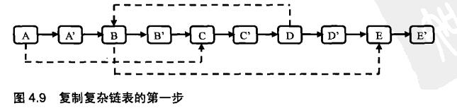
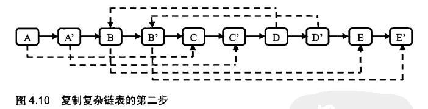
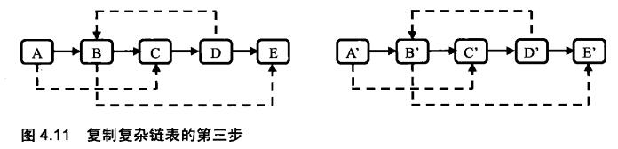
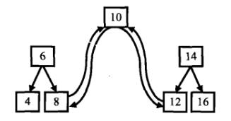
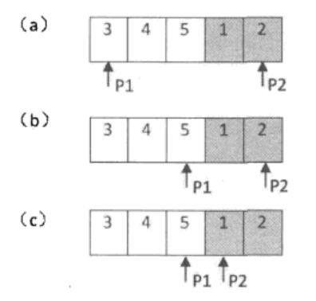
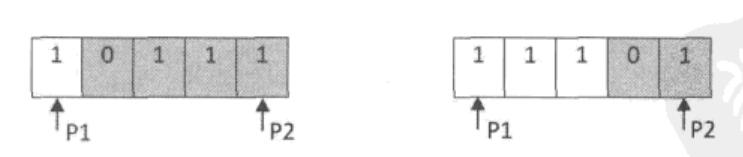
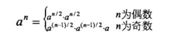

[TOC]

---


### [牛客网刷题页面](https://www.nowcoder.com/ta/coding-interviews)

---

### 一、数据结构类


#### 1. 链表（8）

##### 链表结构体定义
```c
struct ListNode {
	int val;
	struct ListNode* next;
	ListNode(int x) :
		val(x), next(NULL) {
	}
};
```
##### 复杂链表结构体
```c
struct RandomListNode {
    int label;
    struct RandomListNode *next, *random;
    RandomListNode(int x) :
        label(x), next(NULL), random(NULL) {
    }
};
```
##### 链表原则
```
1.使用p->next之前先判断p是否为空
```

##### 1. 003-从尾到头打印链表
**题目描述**

输入一个链表，返回一个反序的链表。

**解题思路**

不希望修改原链表的结构，后进先出，使用栈实现

**参考代码**
```c
class Solution {
public:
    vector<int> printListFromTailToHead(ListNode* head) {
        stack<int> nodes;
        vector<int> result;
        ListNode* pNode = head;
        while(pNode!= NULL){
            nodes.push(pNode->val);
            pNode = pNode->next;
        }
        
        while(!nodes.empty()){
            result.push_back(nodes.top());
            nodes.pop();
        }
        return result;
    }
};
```
##### 2. 014-链表中倒数第k个结点
**题目描述**

输入一个链表，输出该链表中倒数第k个结点。

**解题思路**

定义两个指针，第一个先移动k-1步，然后两个指针同时移动；第一个指针到达末尾时，第二个指针刚好到达倒数第k个结点

**参考代码**
```c
class Solution {
public:
    ListNode* FindKthToTail(ListNode* pListHead, unsigned int k) {
        if(pListHead==NULL||k<=0){
            return NULL;
        }
        ListNode* pAhead=pListHead;
        ListNode* pBehind=pListHead;
        for(unsigned int i=0;i<k-1;i++){
            if(pAhead->next!=NULL){
                pAhead=pAhead->next;
            }
            else{
                return NULL;
            }
        }
        while(pAhead->next!=NULL){
            pAhead=pAhead->next;
            pBehind=pBehind->next;
        }
        return pBehind;
    }
};
```
##### 3. 015-反转链表
**题目描述**

输入一个链表，反转链表后，输出链表的所有元素。

**解题思路**

使用三个指针，分别指向当前遍历到的结点、它的前一个结点以及后一个结点。

遍历时，当前结点的指针指向前一个结点。

**参考代码**
```c
class Solution {
public:
    ListNode* ReverseList(ListNode* pHead) {
        ListNode* pReversedHead = NULL;
        ListNode* pNode = pHead;
        ListNode* pPrev = NULL;
        while(pNode != NULL){
            ListNode* pNext = pNode->next;
            if(pNext == NULL){
                pReversedHead = pNode;
            }
            pNode->next = pPrev;
            pPrev = pNode;
            pNode = pNext;
        }
        return pReversedHead;
    }
};
```
##### 4. 016-合并两个排序的链表
**题目描述**

输入两个单调递增的链表，输出两个链表合成后的链表，当然我们需要合成后的链表满足单调不减规则。

**解题思路**

先判断输入的链表是否为空。如果第一个链表为空，则直接返回第二个链表；如果第二个链表为空，则直接返回第一个链表。如果两个链表都是空链表，合并的结果是得到一个空链表。

两个链表都是排序好的，我们只需要从头遍历链表，判断当前指针，哪个链表中的值小，即赋给合并链表指针即可。使用递归就可以轻松实现。

**参考代码**
```c
class Solution {
public:
    ListNode* Merge(ListNode* pHead1, ListNode* pHead2){
        //判断指针是否为空
        if(pHead1 == NULL){
            return pHead2;
        }
        else if(pHead2 == NULL){
            return pHead1;
        }
        ListNode* pMergedHead = NULL;
        if(pHead1->val < pHead2->val){
            pMergedHead = pHead1;
            pMergedHead->next = Merge(pHead1->next, pHead2);
        }
        else{
            pMergedHead = pHead2;
            pMergedHead->next = Merge(pHead1, pHead2->next);
        }
        return pMergedHead;
    }
};
```
##### 5. 025-复杂链表的复制
**题目描述**

输入一个复杂链表（每个节点中有节点值，以及两个指针，一个指向下一个节点，另一个特殊指针指向任意一个节点），返回结果为复制后复杂链表的head。（注意，输出结果中请不要返回参数中的节点引用，否则判题程序会直接返回空）

**解题思路**

将复杂链表的复制过程分解为三个步骤。

在写代码的时候我们每一步定义一个函数，这样每个函数完成一个功能，整个过程的逻辑也就非常清晰明了了。

我们这里采用三步：

第一步：复制复杂链表的label和next。但是这次我们把复制的结点跟在原结点后面，而不是直接创建新的链表；

第二步：设置复制出来的结点的random。因为新旧结点是前后对应关系，所以也是一步就能找到random；

第三步：拆分链表。奇数是原链表，偶数是复制的链表。







**参考代码**

```c
class Solution {
public:
    
    //第一步，复制复杂链表的label和next
    void CloneNodes(RandomListNode* pHead){
        RandomListNode* pNode = pHead;
        while(pNode != NULL){
            RandomListNode* pCloned = new RandomListNode(0);
            pCloned->label = pNode->label;
            pCloned->next = pNode->next;
            pCloned->random = NULL;
            
            pNode->next = pCloned;
            pNode = pCloned->next;
        }
    }
    
    //第二步，处理复杂链表的random指针
    void ConnectSiblingNodes(RandomListNode* pHead){
        RandomListNode* pNode = pHead;
        while(pNode != NULL){
            RandomListNode* pCloned = pNode->next;
            if(pNode->random != NULL){
                pCloned->random = pNode->random->next;
            }
            pNode = pCloned->next;
        }
    }
    
    //第三步，拆分复杂指针
    RandomListNode* ReconnectNodes(RandomListNode* pHead){
        RandomListNode* pNode = pHead;
        RandomListNode* pClonedHead = NULL;
        RandomListNode* pClonedNode = NULL;
        
        if(pNode != NULL){
            pClonedHead = pClonedNode = pNode->next;
            pNode->next = pClonedNode->next;
            pNode = pNode->next;
        }
        
        while(pNode != NULL){
            pClonedNode->next = pNode->next;
            pClonedNode = pClonedNode->next;
            pNode->next = pClonedNode->next;
            pNode = pNode->next;
        }
        return pClonedHead;
    }
    
    RandomListNode* Clone(RandomListNode* pHead)
    {
        CloneNodes(pHead);
        ConnectSiblingNodes(pHead);
        return ReconnectNodes(pHead);
    }
};
```
##### 6. 036-两个链表的第一个公共结点
**题目描述**

输入两个链表，找出它们的第一个公共结点。

**解题思路**

先让把长的链表的头砍掉，让两个链表长度相同，这样，同时遍历也能找到公共结点。此时，时间复杂度O(m+n)，空间复杂度为O(MAX(m,n))。

**参考代码**
```c
class Solution {
public:
    ListNode* FindFirstCommonNode( ListNode* pHead1, ListNode* pHead2) {
        // 如果有一个链表为空，则返回结果为空
        if(pHead1 == NULL || pHead2 == NULL){
            return NULL;
        }
        // 获得两个链表的长度
        unsigned int len1 = GetListLength(pHead1);
        unsigned int len2 = GetListLength(pHead2);
        // 默认 pHead1 长， pHead2短，如果不是，再更改
        ListNode* pHeadLong = pHead1;
        ListNode* pHeadShort = pHead2;
        int LengthDif = len1 - len2;
        // 如果 pHead1 比 pHead2 小
        if(len1 < len2){
            ListNode* pHeadLong = pHead2;
            ListNode* pHeadShort = pHead1;
            int LengthDif = len2 - len1;
        }
        // 将长链表的前面部分去掉，使两个链表等长
        for(int i = 0; i < LengthDif; i++){
            pHeadLong = pHeadLong->next;
        }
        
        while(pHeadLong != NULL && pHeadShort != NULL && pHeadLong != pHeadShort){
            pHeadLong = pHeadLong->next;
            pHeadShort = pHeadShort->next;
        }
        return pHeadLong;
    }
private:
    // 获得链表长度
    unsigned int GetListLength(ListNode* pHead){
        if(pHead == NULL){
            return 0;
        }
        unsigned int length = 1;
        while(pHead->next != NULL){
            pHead = pHead->next;
            length++;
        }
        return length;
    }
};
```
##### 7. 055-链表中环的入口结点
**题目描述**

一个链表中包含环，请找出该链表的环的入口结点。

**解题思路**

判断是否有环：使用快慢指针，一个每次走一步，一个每次走两步。如果两个指针相遇，表明链表中存在环，并且两个指针相遇的结点一定在环中。

计算环的长度：从相遇的这个环中结点出发，一边继续向前移动一边计数，当再次回到这个结点时，就可以得到环中结点数目了。

寻找环的入口：定义两个指针P1和P2指向链表的头结点。如果链表中的环有n个结点，指针P1先在链表上向前移动n步，然后两个指针以相同的速度向前移动。当第二个指针指向入口结点时，第一个指针已经绕环一圈又回到了入口结点，它们相遇的结点正好是环的入口结点。

**参考代码**
```c
class Solution {
public:
    ListNode* EntryNodeOfLoop(ListNode* pHead)
    {
        if(pHead == NULL){
            return NULL;
        }
        ListNode* meetingnode = MeetingNode(pHead);
        if(meetingnode == NULL){
            return NULL;
        }
        // 回环链表结点个数
        int nodesloop = 1;
        // 找到环中结点个数
        ListNode* pNode1 = meetingnode;
        while(pNode1->next != meetingnode){
            pNode1 = pNode1->next;
            nodesloop++;
        }
        pNode1 = pHead;
        // 第一个指针向前移动nodesloop步
        for(int i = 0; i < nodesloop; i++){
            pNode1 = pNode1->next;
        }
        // 两个指针同时移动，找到环入口
        ListNode* pNode2 = pHead;
        while(pNode1 != pNode2){
            pNode1 = pNode1->next;
            pNode2 = pNode2->next;
        }
        return pNode1;
    }
private:
    // 使用快慢指针，找到任意的一个环中结点
    ListNode* MeetingNode(ListNode* pHead){
        ListNode* pSlow = pHead->next;
        if(pSlow == NULL){
            return NULL;
        }
        ListNode* pFast = pSlow->next;
        while(pFast != NULL && pSlow != NULL){
            if(pFast == pSlow){
                return pFast;
            }
            pSlow = pSlow->next;
            pFast = pFast->next;
            if(pFast != NULL){
                pFast = pFast->next;
            }
        }
        return NULL;
    }
};
```
##### 8. 056-删除链表中重复的结点
**题目描述**

在一个排序的链表中，存在重复的结点，请删除该链表中重复的结点，重复的结点不保留，返回链表头指针。 例如，链表1->2->3->3->4->4->5 处理后为 1->2->5。

**解题思路**

删除重复结点，只需要记录当前结点前的最晚访问过的不重复结点pPre、当前结点pCur、指向当前结点后面的结点pNext的三个指针即可。如果当前节点和它后面的几个结点数值相同，那么这些结点都要被删除，然后更新pPre和pCur；如果不相同，则直接更新pPre和pCur。

需要考虑的是，如果第一个结点是重复结点我们该怎么办？这里我们分别处理一下就好，如果第一个结点是重复结点，那么就把头指针pHead也更新一下。

**参考代码**
```c
class Solution {
public:
    ListNode* deleteDuplication(ListNode* pHead)
    {
        if(pHead == NULL){
            return NULL;
        }
        // 指向当前结点前最晚访问过的不重复结点
        ListNode* pPre = NULL;
        // 指向当前处理的结点
        ListNode* pCur = pHead;
        // 指向当前结点后面的结点
        ListNode* pNext = NULL;
        
        while(pCur != NULL){
            // 如果当前结点与下一个结点相同
            if(pCur->next != NULL && pCur->val == pCur->next->val){
                pNext = pCur->next;
                // 找到不重复的最后一个结点位置
                while(pNext->next != NULL && pNext->next->val == pCur->val){
                    pNext = pNext->next;
                }
                // 如果pCur指向链表中第一个元素，pCur -> ... -> pNext ->... 
                // 要删除pCur到pNext, 将指向链表第一个元素的指针pHead指向pNext->next。
                if(pCur == pHead){
                    pHead = pNext->next;
                }
                // 如果pCur不指向链表中第一个元素，pPre -> pCur ->...->pNext ->... 
                // 要删除pCur到pNext，即pPre->next = pNext->next
                else{
                    pPre->next = pNext->next;
                }
                // 向前移动
                pCur = pNext->next;
            }
            // 如果当前结点与下一个结点不相同
            else{
                pPre = pCur;
                pCur = pCur->next;
            }
        }
        return pHead;
    }
};
```


#### 2. 数组（5）


##### 1. 013-调整数组顺序使奇数位于偶数前面
**题目描述**

输入一个整数数组，实现一个函数来调整该数组中数字的顺序，使得所有的奇数位于数组的前半部分，所有的偶数位于位于数组的后半部分，并保证奇数和奇数，偶数和偶数之间的相对位置不变。

**解题思路**

创建双向队列，遍历数组，奇数前插入，偶数后插入。最后使用assign方法实现不同容器但相容的类型赋值。

**参考代码**
```c
class Solution {
public:
    void reOrderArray(vector<int> &array) {
        deque<int> result;
        int num = array.size();
        for(int i = 0; i < num; i++){
            if(array[num - i - 1] % 2 == 1){
                result.push_front(array[num - i - 1]);
            }
            if(array[i] % 2 == 0){
                result.push_back(array[i]);
            }
        }
        array.assign(result.begin(),result.end());
    }
};
```

##### 2. 028-数组中出现次数超过一半的数字
**题目描述**

数组中有一个数字出现的次数超过数组长度的一半，请找出这个数字。例如输入一个长度为9的数组{1,2,3,2,2,2,5,4,2}。由于数字2在数组中出现了5次，超过数组长度的一半，因此输出2。如果不存在则输出0。

**解题思路**

数组中有一个数字出现的次数超过数组长度的一半，也就是说它出现的次数比其他所有数字出现次数的和还要多。因此我们可以考虑在遍历数组的时候保存两个值：一个是数组中的一个数字，一个是这个数字出现的次数。当我们遍历到下一个数字的时候，如果下一个数字和我们之前保存的数字相同，则次数加1；如果下一个数字和我们之前保存的数字不同，则次数减1。如果次数为零，我们需要保存下一个数字，并把次数设为1。由于我们要找的数字出现的次数比其他所有数字出现的次数之和还要多，那么要找的数字肯定是最后一次把次数设为1时对应的数字。

**参考代码**
```c++
class Solution {
public:
    int MoreThanHalfNum_Solution(vector<int> numbers) {
        if(numbers.empty()){
            return 0;
        }
        // 遍历每个元素，并记录次数；若与前一个元素相同，则次数加1，否则次数减1
        int result = numbers[0];
        int times = 1;
        for(int i = 1; i < numbers.size(); ++i){
            if(times == 0){
                // 更新result的值为当前元素，并置次数为1
                result = numbers[i];
                times = 1;
            }
            else if(numbers[i] == result){
                times++;
            }
            else{
                times--;
            }
        }
        // 判断result是否符合条件，即出现次数大于数组长度的一半
        times = 0;
        for(int i = 0; i < numbers.size(); ++i)
        {
            if(numbers[i] == result){
                times++;
            }
        }
        return (times > (numbers.size() >> 1)) ? result : 0;
    }
};
```

##### 3. 032-把数组排成最小的数
**题目描述**

输入一个正整数数组，把数组里所有数字拼接起来排成一个数，打印能拼接出的所有数字中最小的一个。例如输入数组{3，32，321}，则打印出这三个数字能排成的最小数字为321323。

**解题思路**

遇到这个题，全排列当然可以做，但是时间复杂度为O(n!)。

在这里我们自己定义一个规则，对拼接后的字符串进行比较。

排序规则如下：

若ab > ba 则 a 大于 b，
若ab < ba 则 a 小于 b，
若ab = ba 则 a 等于 b；
根据上述规则，我们需要先将数字转换成字符串再进行比较，因为需要串起来进行比较。比较完之后，按顺序输出即可。

**参考代码**

```C++
class Solution {
public:
    string PrintMinNumber(vector<int> numbers) {
        int length = numbers.size();
        if(length == 0){
            return "";
        }
        sort(numbers.begin(), numbers.end(), cmp);
        string res;
        for(int i = 0; i <　length; i++){
            res += to_string(numbers[i]);
        }
        return res;
    }
private:
    // 升序排序
    static bool cmp(int a, int b){
        string A = to_string(a) + to_string(b);
        string B = to_string(b) + to_string(a);
        return A < B;
    }
};
```

##### 4. 050-数组中重复的数字
**题目描述**

在一个长度为n的数组里的所有数字都在0到n-1的范围内。数组中某些数字是重复的，但不知道有几个数字是重复的,也不知道每个数字重复几次。请找出数组中任意一个重复的数字。例如，如果输入长度为7的数组{2,3,1,0,2,5,3}，那么对应的输出是第一个重复的数字2。

**解题思路**

把当前序列当成是一个下标和下标对应值是相同的数组（时间复杂度为O(n),空间复杂度为O(1)）；

遍历数组，

判断当前位的值和下标是否相等：

若相等，则遍历下一位；

若不等，则将当前位置i上的元素和a[i]位置上的元素比较：若它们相等，则找到了第一个相同的元素；若不等，则将它们交换。换完之后a[i]位置上的值和它的下标是对应的，但i位置上的元素和下标并不一定对应；重复上面的操作，直到当前位置i的值也为i，将i向后移一位，再重复操作。

**参考代码**

```C++
class Solution {
public:
    // Parameters:
    //        numbers:     an array of integers
    //        length:      the length of array numbers
    //        duplication: (Output) the duplicated number in the array number
    // Return value:       true if the input is valid, and there are some duplications in the array number
    //                     otherwise false
    bool duplicate(int numbers[], int length, int* duplication) {
        // 非法输入
        if(numbers == NULL || length <= 0){
            return false;
        }
        // 非法输入
        for(int i = 0; i < length; i++){
            if(numbers[i] < 0 || numbers[i] > length - 1){
                return false;
            }
        }
        // 遍历查找第一个重复的数
        for(int i = 0; i < length; i++){
            while(numbers[i] != i){
                if(numbers[i] == numbers[numbers[i]]){
                    *duplication = numbers[i];
                    return true;
                }
                swap(numbers[i], numbers[numbers[i]]);
            }
        }
        return false;
    }
};
```

##### 5. 051-构建乘积数组
**题目描述**

给定一个数组A[0,1,...,n-1],请构建一个数组B[0,1,...,n-1],其中B中的元素B[i]=A[0]*A[1]*...*A[i-1]*A[i+1]*...*A[n-1]。不能使用除法。

**解题思路**

观察下公式，你会发现，B[i]公式中没有A[i]项，

现在要求不能使用除法。一个直观的解法是用连乘n-1个数字得到B[i]。显然这个方法需要O(n*n)的时间复杂度。

好在还有更高效的算法。可以把B[i]=A[0]*A[1]*.....*A[i-1]*A[i+1]*.....*A[n-1]。看成A[0]*A[1]*.....*A[i-1]和A[i+1]*.....A[n-2]*A[n-1]两部分的乘积。

即通过A[i]项将B[i]分为两部分的乘积。效果如下图所示：


不妨设定C[i]=A[0]*A[1]*...*A[i-1]，D[i]=A[i+1]*...*A[n-2]*A[n-1]。C[i]可以用自上而下的顺序计算出来，即C[i]=C[i-1]*A[i-1]。类似的，D[i]可以用自下而上的顺序计算出来，即D[i]=D[i+1]*A[i+1]。


第一个for循环用来计算上图1范围的数，第二个for循环用来计算上图2范围的数。

**参考代码**

```c++
class Solution {
public:
    vector<int> multiply(const vector<int>& A) {
        int length = A.size();
        vector<int> B(length);
        if(length <= 0){
            return B;
        }
        B[0] = 1;
        for(int i = 1; i < length; i++){
            B[i] = B[i - 1] * A[i - 1];
        }
        int temp = 1;
        for(int i = length - 2; i >= 0; i--){
            temp *= A[i + 1];
            B[i] *= temp;
        }
        return B;
    }
};
```


#### 3. 字符串（4）


##### 1. 002-替换空格
**题目描述**

请实现一个函数，将一个字符串中的空格替换成“%20”。

例如，当字符串为We Are Happy.则经过替换之后的字符串为We%20Are%20Happy。

**解题思路**

采用一种时间复杂度为O(n)的方法。

我们可以先遍历一次字符串，这样就可以统计出字符串空格的总数，并可以由此计算出替换之后的字符串的总长度。每替换一个空格，长度增加2，因此替换以后字符串的长度等于原来的长度加上2倍的空格数目。以"We are happy"为例，"We are happy"这个字符串的长度为14（包括结尾符号"\n"），里面有两个空格，因此替换之后字符串的长度是18。

我们从字符串的尾部开始复制和替换。首先准备两个指针，P1和P2，P1指向原始字符串的末尾，而P2指向替换之后的字符串的末尾。接下来我们向前移动指针P1，逐个把它指向的字符复制到P2指向的位置，直到碰到第一个空格为止。碰到第一个空格之后，把P1向前移动1格，在P2之前插入字符串"%20"。由于"%20"的长度为3，同时也要把P2向前移动3格。

**参考代码**

```c++
class Solution {
public:
	void replaceSpace(char *str,int length) {
		if(str == NULL || length <= 0){
            return;
        }
        /*original_length为字符串str的实际长度*/
        int original_length = 0;			//原始长度
        int number_blank = 0;				//空格数
        int i;
        while(str[i++] != '\0'){				//遍历字符串
            ++original_length;				//长度+1
            if(str[i] == ' '){
                ++number_blank;				//遇到空格+1
            }
        }
        /*new_length为把空格替换成'%20'之后的长度*/
        int new_length = original_length + 2 * number_blank;
        
        int index_original = original_length-1;	//原始字符串末尾索引值
        int index_new = new_length-1;				//计算长度后的字符串末尾索引值
        
        /*index_original指针开始向前移动，如果遇到空格，替换成'%20'，否则进行复制操作*/
        while(index_original >= 0 && index_new > index_original){
            if(str[index_original] == ' '){
                str[index_new--] = '0';
                str[index_new--] = '2';
                str[index_new--] = '%';
            }
            else{
                str[index_new--] = str[index_original];
            }
            --index_original;
        }
	}
};
```


##### 2. 043-左旋转字符串
**题目描述**

汇编语言中有一种移位指令叫做循环左移（ROL），现在有个简单的任务，就是用字符串模拟这个指令的运算结果。对于一个给定的字符序列S，请你把其循环左移K位后的序列输出。例如，字符序列S=”abcXYZdef”,要求输出循环左移3位后的结果，即“XYZdefabc”。是不是很简单？OK，搞定它！

**解题思路**

例如：输入字符串"abcdefg"和数字2，该函数将返回左旋转2位得到的结果"cdefgab";

 

第一步：翻转字符串“ab”，得到"ba"；

第二步：翻转字符串"cdefg"，得到"gfedc"；

第三步：翻转字符串"bagfedc"，得到"cdefgab"；

或者：

第一步：翻转整个字符串"abcdefg",得到"gfedcba"

第二步：翻转字符串“gfedc”，得到"cdefg"

第三步：翻转字符串"ba",得到"ab"

**参考代码**

```c++
class Solution {
public:
    string LeftRotateString(string str, int n) {
        string result = str;
        int length = result.size();
        if(length < 0){
            return NULL;
        }
        if(0 <= n <= length){
            int pFirstBegin = 0, pFirstEnd = n - 1;
            int pSecondBegin = n, pSecondEnd = length - 1;
            ReverseString(result, pFirstBegin, pFirstEnd);
            ReverseString(result, pSecondBegin, pSecondEnd);
            ReverseString(result, pFirstBegin, pSecondEnd);
        }
        return result;
    }
private:
    void ReverseString(string &str, int begin, int end){
        while(begin < end){
            swap(str[begin++], str[end--]);
        }
    }
};
```


##### 3. 049-把字符串转换成整数
**题目描述**

将一个字符串转换成一个整数，要求不能使用字符串转换整数的库函数。 数值为0或者字符串不是一个合法的数值则返回0。

*输入描述：*输入一个字符串,包括数字字母符号,可以为空

*输出描述：*如果是合法的数值表达则返回该数字，否则返回0

**解题思路**

这道题要考虑全面，对异常值要做出处理。

对于这个题目，需要注意的要点有：

- 字符串是否为空字符串；
- 字符串对于正负号的处理；
- 输入值是否为合法值，即小于等于'9'，大于等于'0'；
- int为32位，需要判断是否溢出；
- 最好使用错误标志，区分合法值0和非法值0。

**参考代码**

```c++
class Solution {
public:
    int StrToInt(string str) {
        /*
         flag：标记第一位是否是负号；
          
         首先判断第一个字符是不是正负号，如果是正负号，表明数字从str[1]开始；
         另外如果是负号，要用flag记住，后面得出数字需要补充符号。
        */
        if(str.empty()){
            return 0;
        }
        int flag=0;
        char* c_str=&str[0];
        if(*c_str=='+'||*c_str=='-'){
            if(*c_str=='-'){
                flag=1;
            }
            *c_str++;
        }
        int result=0;
        while(*c_str!='\0'){
            result*=10;
            if(*c_str>='0'&&*c_str<='9'){
                result+=int(*c_str++-'0');
                if((!flag&&result>0x7fffffff)||(flag&&result<(signed int)0x80000000)){
                    result=0;
                    break;
                }
            }
            else{
                result=0;
                break;
            }
        }
        if(flag==1){
            result*=-1;
        }
        return result;
    }
};        
```


##### 4. 053-表示数值的字符串
**题目描述**

请实现一个函数用来判断字符串是否表示数值（包括整数和小数）。例如，字符串"+100","5e2","-123","3.1416"和"-1E-16"都表示数值。 但是"12e","1a3.14","1.2.3","+-5"和"12e+4.3"都不是。

**解题思路**

这道题还是比较简单的。表示数值的字符串遵循如下模式：

```makefile
[sign]integral-digits[.[fractional-digits]][e|E[sign]exponential-digits]
```


其中，('['和']'之间的为可有可无的部分)。

在数值之前可能有一个表示正负的'+'或者'-'。接下来是若干个0到9的数位表示数值的整数部分（在某些小数里可能没有数值的整数部分）。如果数值是一个小数，那么在小数后面可能会有若干个0到9的数位表示数值的小数部分。如果数值用科学记数法表示，接下来是一个'e'或者'E'，以及紧跟着的一个整数（可以有正负号）表示指数。

判断一个字符串是否符合上述模式时，首先看第一个字符是不是正负号。如果是，在字符串上移动一个字符，继续扫描剩余的字符串中0到9的数位。如果是一个小数，则将遇到小数点。另外，如果是用科学记数法表示的数值，在整数或者小数的后面还有可能遇到'e'或者'E'。

**参考代码**

```c++
class Solution {
public:
    // 数字的格式可以用A[.[B]][e|EC]或者.B[e|EC]表示，
    // 其中A和C都是整数（可以有正负号，也可以没有）
    // 而B是一个无符号整数
    bool isNumeric(char* string){
        // 非法输入
        if(string == NULL || *string == '\0'){
            return false;
        }
        // 正负号判断
        if(*string == '+' || *string == '-'){
            ++string;
        }
        bool numeric = true;
        scanDigits(&string);
        if(*string != '\0'){
            // 小数判断
            if(*string == '.'){
                ++string;
                scanDigits(&string);
                if(*string == 'e' || *string == 'E'){
                    numeric = isExponential(&string);
                }
            }
            // 整数判断
            else if(*string == 'e' || *string == 'E'){
                numeric = isExponential(&string);
            }
            else{
                numeric = false;
            }
        }
        return numeric && *string == '\0';
    }
private:
    // 扫描数字，对于合法数字，直接跳过
    void scanDigits(char** string){
        while(**string != '\0' && **string >= '0' && **string <= '9'){
            ++(*string);
        }
    }
    // 用来判断科学计数法表示的数值的结尾部分是否合法
    bool isExponential(char** string){
        ++(*string);
        if(**string == '+' || **string == '-'){
            ++(*string);
        }
        if(**string == '\0'){
            return false;
        }
        scanDigits(string);
        // 判断是否结尾，如果没有结尾，说明还有其他非法字符串
        return (**string == '\0') ? true : false;
    }
};
```


#### 4. 栈与队列(5)

##### 结构体定义


##### 1. 005-用两个栈实现队列
**题目描述**

用两个栈来实现一个队列，完成队列的Push和Pop操作。 队列中的元素为int类型。

**解题思路**

创建两个栈stack1和stack2，使用两个“先进后出”的栈实现一个“先进先出”的队列。

当stack2中不为空时，在stack2中的栈顶元素是最先进入队列的元素，可以弹出。如果stack2为空时，我们把stack1中的元素逐个弹出并压入stack2。由于先进入队列的元素被压倒stack1的栈底，经过弹出和压入之后就处于stack2的栈顶，有可以直接弹出。如果有新元素d插入，我们直接把它压入stack1即可。

**参考代码**

```c++
class Solution
{
public:
    void push(int node) {
        stack1.push(node);
    }

    int pop() {
        if(stack2.empty()){
            while(stack1.size() > 0){
                int data = stack1.top();
                stack1.pop();
                stack2.push(data);
            }
        }
        int pop_element = stack2.top();
        stack2.pop();
        return pop_element;
    }

private:
    stack<int> stack1;
    stack<int> stack2;
};
```


##### 2. 020-包含min函数的栈
**题目描述**

定义栈的数据结构，请在类型中实现一个能够得到栈最小元素的min函数。

**解题思路**

使用两个stack，一个为数据栈，另一个为辅助栈。数据栈用于存储所有数据，辅助栈用于存储最小值。

举个例子：

入栈的时候：首先往空的数据栈里压入数字3，显然现在3是最小值，我们也把最小值压入辅助栈。接下来往数据栈里压入数字4。由于4大于之前的最小值，因此我们只要入数据栈，不压入辅助栈。

出栈的时候：当数据栈和辅助栈的栈顶元素相同的时候，辅助栈的栈顶元素出栈。否则，数据栈的栈顶元素出栈。

获得栈顶元素的时候：直接返回数据栈的栈顶元素。

栈最小元素：直接返回辅助栈的栈顶元素。

**参考代码**

```c++
class Solution {
public:
    void push(int value) {
        Data.push(value);
        if(Min.empty()){
            Min.push(value);
        }
        if(Min.top() > value){
            Min.push(value);
        }
    }
    void pop() {
        if(Data.top() == Min.top()){
            Min.pop();
        }
        Data.pop();
    }
    int top() {
        return Data.top();
    }
    int min() {
        return Min.top();
    }
private:
    stack<int> Data;			//数据栈
    stack<int> Min;				//最小栈
};
```


##### 3. 021-栈的压入、弹出序列
**题目描述**

输入两个整数序列，第一个序列表示栈的压入顺序，请判断第二个序列是否为该栈的弹出顺序。假设压入栈的所有数字均不相等。例如序列1,2,3,4,5是某栈的压入顺序，序列4，5,3,2,1是该压栈序列对应的一个弹出序列，但4,3,5,1,2就不可能是该压栈序列的弹出序列。（注意：这两个序列的长度是相等的）

**解题思路**

借用一个辅助的栈，先将第一个元素放入栈中，这里是1，然后判断栈顶元素是不是出栈顺序的第一个元素，这里是4，很显然1≠4，所以我们继续压栈，直到相等以后开始出栈，出栈一个元素，则将出栈顺序向后移动一位，直到不相等，这样循环等压栈顺序遍历完成，如果辅助栈还不为空，说明弹出序列不是该栈的弹出顺序。

**参考代码**

```c++
class Solution {
public:
    bool IsPopOrder(vector<int> pushV,vector<int> popV) {
        if(pushV.size() == 0){
            return false;
        }
        for(int i = 0, j = 0; i < pushV.size();i++){
            stackData.push(pushV[i]);
            //注意此处j<popV.size()
          	while(j < popV.size() && stackData.top() == popV[j]){
                stackData.pop();
                j++;
            }
        }
        return stackData.empty();
    }
private:
    stack<int> stackData;
};
```


##### 4.044-翻转单词顺序列(栈)
**题目描述**

牛客最近来了一个新员工Fish，每天早晨总是会拿着一本英文杂志，写些句子在本子上。同事Cat对Fish写的内容颇感兴趣，有一天他向Fish借来翻看，但却读不懂它的意思。例如，“student. a am I”。后来才意识到，这家伙原来把句子单词的顺序翻转了，正确的句子应该是“I am a student.”。Cat对一一的翻转这些单词顺序可不在行，你能帮助他么？

**解题思路**

观察字符串变化规律，你会发现这道题很简单。只需要对每个单词做翻转，然后再整体做翻转就得到了正确的结果。

**参考代码**

```c++
class Solution {
public:
    string ReverseSentence(string str) {
        string result = str;
        int length = result.size();
        if(length == 0){
            return "";
        }
        // 追加一个空格，作为反转标志位
        result += ' ';
        int mark = 0;
        // 根据空格，反转所有单词
        for(int i = 0; i < length + 1; i++){
            if(result[i] == ' '){
                Reverse(result, mark, i - 1);
                mark = i + 1;
            }
        }
        // 去掉添加的空格
        result = result.substr(0, length);
        // 整体反转
        Reverse(result, 0, length - 1);
        
        return result;
    }
private:
    void Reverse(string &str, int begin, int end){
        while(begin < end){
            swap(str[begin++], str[end--]);
        }
    }
};
```


##### 5. 064-滑动窗口的最大值(双端队列)
**题目描述**

给定一个数组和滑动窗口的大小，找出所有滑动窗口里数值的最大值。例如，如果输入数组{2,3,4,2,6,2,5,1}及滑动窗口的大小3，那么一共存在6个滑动窗口，他们的最大值分别为{4,4,6,6,6,5}； 针对数组{2,3,4,2,6,2,5,1}的滑动窗口有以下6个： {[2,3,4],2,6,2,5,1}， {2,[3,4,2],6,2,5,1}， {2,3,[4,2,6],2,5,1}， {2,3,4,[2,6,2],5,1}， {2,3,4,2,[6,2,5],1}， {2,3,4,2,6,[2,5,1]}。


**解题思路**

使用一个双端队列，用STL中的deque来实现。

接下来我们以数组{2,3,4,2,6,2,5,1}为例，来细说整体思路。

数组的第一个数字是2，把它存入队列中。第二个数字是3，比2大，所以2不可能是滑动窗口中的最大值，因此把2从队列里删除，再把3存入队列中。第三个数字是4，比3大，同样的删3存4。此时滑动窗口中已经有3个数字，而它的最大值4位于队列的头部。

第四个数字2比4小，但是当4滑出之后它还是有可能成为最大值的，所以我们把2存入队列的尾部。下一个数字是6，比4和2都大，删4和2，存6。就这样依次进行，最大值永远位于队列的头部。

但是我们怎样判断滑动窗口是否包括一个数字？应该在队列里存入数字在数组里的下标，而不是数值。当一个数字的下标与当前处理的数字的下标之差大于或者相等于滑动窗口大小时，这个数字已经从窗口中滑出，可以从队列中删除。

整体过程示意图：


**参考代码**

```c++
class Solution {
public:
    vector<int> maxInWindows(const vector<int>& num, unsigned int size)
    {
        vector<int> maxInWindows;
        // 数组大小要大于等于窗口大小，并且窗口大小大于等于1
        if(num.size() >= size && size >= 1){
            deque<int> index;
            for(unsigned int i = 0; i < size; i++){
                // 如果index非空，并且新添加的数字大于等于队列中最小的数字，则删除队列中最小的数字
                while(!index.empty() && num[i] >= num[index.back()]){
                    index.pop_back();
                }
                index.push_back(i);
            }
            for(unsigned int i = size; i < num.size(); i++){
                maxInWindows.push_back(num[index.front()]);
                while(!index.empty() && num[i] >= num[index.back()]){
                    index.pop_back();
                }
                // 控制窗口大小为size
                if(!index.empty() && index.front() <= int(i - size)){
                    index.pop_front();
                }
                index.push_back(i);
            }
            maxInWindows.push_back(num[index.front()]);
        }
        return maxInWindows;
    }
};
```


#### 5. 二叉树（12）

##### 结构体定义

```c++
Definition for binary tree
struct TreeNode {
	int val;
	TreeNode *left;
	TreeNode *right;
	TreeNode(int x) : val(x), left(NULL), right(NULL) {}
};
```


##### 1. 004-重建二叉树
**题目描述**

输入某二叉树的前序遍历和中序遍历的结果，请重建出该二叉树。假设输入的前序遍历和中序遍历的结果中都不含重复的数字。例如输入前序遍历序列{1,2,4,7,3,5,6,8}和中序遍历序列{4,7,2,1,5,3,8,6}，则重建二叉树并返回。

**解题思路**

通常树有如下几种遍历方式：

- 前序遍历：先访问根结点，再访问左子结点，最后访问右子结点。
- 中序遍历：先访问左子结点，再访问根结点，最后访问右子结点。
- 后序遍历：先访问左子结点，再访问右子结点，最后访问根结点。

本题为前序遍历和中序遍历，最少需要两种遍历方式，才能重建二叉树。

前序遍历序列中，第一个数字总是树的根结点的值。在中序遍历序列中，根结点的值在序列的中间，左子树的结点的值位于根结点的值的左边，而右子树的结点的值位于根结点的值的右边。剩下的我们可以递归来实现.

**参考代码**

```c++
class Solution {
public:
    TreeNode* reConstructBinaryTree(vector<int> pre,vector<int> vin) {
        if(pre.size() == 0){					//如果为空，返回NULL
            return NULL;
        }
        //依次是前序遍历左子树，前序遍历右子树，中序遍历左子树，中序遍历右子树
        vector<int> left_pre, right_pre, left_vin, right_vin;
        //中序遍历第一个节点一定为根节点
        TreeNode* head = new TreeNode(pre[0]);
        //找到中序遍历的根节点
        int root = 0;
        //遍历找到中序遍历根节点索引值
        for(int i = 0; i < pre.size(); i++){
            if(pre[0] == vin[i]){
                root = i;
                break;
            }
        }
       	//利用中序遍历的根节点，对二叉树节点进行归并
        for(int i = 0; i < root; i++){
            left_vin.push_back(vin[i]);
            left_pre.push_back(pre[i + 1]);			//前序遍历第一个为根节点
        }
        
        for(int i = root + 1; i < pre.size(); i++){
            right_vin.push_back(vin[i]);
            right_pre.push_back(pre[i]);
        }
        
        //递归，再对其进行上述所有步骤，即再区分子树的左、右子子数，直到叶节点
        head->left = reConstructBinaryTree(left_pre, left_vin);
        head->right = reConstructBinaryTree(right_pre, right_vin);
        return head;
    }
};
```


##### 2. 017-树的子结构
**题目描述**

输入两颗二叉树A，B，判断B是不是A的子结构。（PS：我们约定空树不是任意一个树的子结构）。

**解题思路**

要查找树A中是否存在和树B结构一样的子树，我们可以分为两步：第一步在树A中找到和B的根结点的值一样的结点R，第二步再判断树A中以R为根节点的子树是不是包含和树B一样的结构。

这里使用递归的方法即可。

**参考代码**

```c++
class Solution {
public:
    bool HasSubtree(TreeNode* pRoot1, TreeNode* pRoot2)
    {
		bool result = false;
        if(pRoot1 != NULL && pRoot2 != NULL){
            if(pRoot1->val == pRoot2->val){
            result = DoesTree1HasTree2(pRoot1, pRoot2);
        }
            if(!result){
                result = HasSubtree(pRoot1->left, pRoot2);
            }
            if(!result){
                result = HasSubtree(pRoot1->right, pRoot2);
            }
        }
        return result;
    }
private:
    bool DoesTree1HasTree2(TreeNode* pRoot1, TreeNode* pRoot2){
        if(pRoot2 == NULL){
            return true;
        }
        if(pRoot1 == NULL){
            return false;
        }
        if(pRoot1->val != pRoot2->val){
            return false;
        }
        return DoesTree1HasTree2(pRoot1->left, pRoot2->left) && DoesTree1HasTree2(pRoot1->right, pRoot2->right);
    }
};
```


##### 3. 018-二叉树的镜像
**题目描述**

操作给定的二叉树，将其变换为源二叉树的镜像。

**解题思路**

先交换根节点的两个子结点之后，我们注意到值为10、6的结点的子结点仍然保持不变，因此我们还需要交换这两个结点的左右子结点。做完这两次交换之后，我们已经遍历完所有的非叶结点。此时变换之后的树刚好就是原始树的镜像。

**参考代码**

```c++
class Solution {
public:
    void Mirror(TreeNode *pRoot) {
				if((pRoot == NULL) || (pRoot->left == NULL && pRoot->right == NULL)){
            return;
        }
        
        //交换根节点的左右结点
        TreeNode *pTemp = pRoot->left;
        pRoot->left = pRoot->right;
        pRoot->right = pTemp;
        
        //递归左子树
        if(pRoot->left){
            Mirror(pRoot->left);
        }
        //递归右子树
        if(pRoot->right){
            Mirror(pRoot->right);
        }
    }
};
```


##### 4. 022-从上往下打印二叉树
**题目描述**

从上往下打印出二叉树的每个节点，同层节点从左至右打印。

**解题思路**

层次遍历，队列实现

**参考代码**

```c++
class Solution {
public:
    vector<int> PrintFromTopToBottom(TreeNode* root) {
        TreeNode* fr;
        if(root == NULL){
            return result;
        }
        que.push(root);
        while(!que.empty()){
            fr = que.front();
            result.push_back(fr->val);
            if(fr->left != NULL){
                que.push(fr->left);
            }
            if(fr->right != NULL){
                que.push(fr->right);
            }
            que.pop();
        }
        return result;
    }
private:
    vector<int> result;
    queue<TreeNode*> que;
};
```


##### 5. 024-二叉树中和为某一值的路径

**题目描述**

输入一颗二叉树和一个整数，打印出二叉树中结点值的和为输入整数的所有路径。路径定义为从树的根结点开始往下一直到叶结点所经过的结点形成一条路径。

**解题思路**

深度优先搜索。使用前序遍历，使用两个全局变量result和tmp，result来存放最终结果，tmp用来存放临时结果。

每次遍历，我们先把root的值压入tmp，然后判断当前root是否同时满足：

- 与给定数值相减为0；
- 左子树为空；
- 右子树为空。

如果满足条件，就将tmp压入result中，否则，依次遍历左右子树。需要注意的是，遍历左右子树的时候，全局变量tmp是不清空的，直到到了根结点才请空tmp。

**参考代码**

```c++
class Solution {
public:
    vector<vector<int> > FindPath(TreeNode* root,int expectNumber){
        if(root == NULL){
            return result;
        }
        
        tmp.push_back(root->val);
        if((expectNumber - root->val ) == 0 && root->left == NULL && root->right == NULL){
            result.push_back(tmp);
        }
        
        //遍历左子树
        FindPath(root->left, expectNumber - root->val);
        //遍历右子树
        FindPath(root->right, expectNumber - root->val);
        
        tmp.pop_back();
        return result;
    }
private:
    vector<vector<int> > result;
    vector<int> tmp;
};
```


##### 6. 038-二叉树的深度
**题目描述**

输入一棵二叉树，求该树的深度。从根结点到叶结点依次经过的结点（含根、叶结点）形成树的一条路径，最长路径的长度为树的深度。

**解题思路**

递归即可

**参考代码**

```c++
class Solution {
public:
    int TreeDepth(TreeNode* pRoot)
    {
        if(pRoot == NULL){
            return 0;
        }
        int left = TreeDepth(pRoot->left);
        int right = TreeDepth(pRoot->right);
        return (left > right) ? (left + 1) : (right + 1);
    }
};
```


##### 7. 039-平衡二叉树
**题目描述**

输入一棵二叉树，判断该二叉树是否是平衡二叉树。

**解题思路**

后序遍历，利用6-038中的深度即可

**参考代码**

```c++
class Solution {
public:
    bool IsBalanced_Solution(TreeNode* pRoot) {
        if(pRoot == NULL){
            return true;
        }
        int left = TreeDepth(pRoot->left);
        int right = TreeDepth(pRoot->right);
        int diff = left - right;
        if(diff > 1 || diff < -1){
            return false;
        }
        return IsBalanced_Solution(pRoot->right) && IsBalanced_Solution(pRoot->left);
    }
private:
    int TreeDepth(TreeNode* pRoot)
    {
        if(pRoot == NULL){
            return 0;
        }
        int left = TreeDepth(pRoot->left);
        int right = TreeDepth(pRoot->right);
        return (left > right) ? (left + 1) : (right + 1);
    }
};
```


##### 8. 057-二叉树的下一个结点
**题目描述**

给定一个二叉树和其中的一个结点，请找出中序遍历顺序的下一个结点并且返回。注意，树中的结点不仅包含左右子结点，同时包含指向父结点的指针。

**解题思路**


以上图为例进行讲解，上图二叉树的中序遍历是d,b,h,e,i,a,f,c,g。我们以这棵树为例来分析如何找出二叉树的下一个结点。

如果一个结点有右子树，那么它的下一个结点就是它的右子树的最左子结点。也就是说从右子结点出发一直沿着指向左子树结点的指针，我们就能找到它的下一个结点。例如，图中结点b的下一个结点是h，结点a的下一个结点是f。

接着我们分析一下结点没有右子树的情形。如果结点是它父结点的左子结点，那么它的下一个结点就是它的父结点。例如，途中结点d的下一个结点是b，f的下一个结点是c。

如果一个结点既没有右子树，并且它还是父结点的右子结点，这种情形就比较复杂。我们可以沿着指向父结点的指针一直向上遍历，直到找到一个是它父结点的左子结点的结点。如果这样的结点存在，那么这个结点的父结点就是我们要找的下一个结点。例如，为了找到结点g的下一个结点，我们沿着指向父结点的指针向上遍历，先到达结点c。由于结点c是父结点a的右结点，我们继续向上遍历到达结点a。由于结点a是树的根结点。它没有父结点。因此结点g没有下一个结点。

**参考代码**

```c++
class Solution {
public:
    TreeLinkNode* GetNext(TreeLinkNode* pNode)
    {
        if(pNode == NULL){
            return NULL;
        }
        TreeLinkNode* pNext = NULL;
        // 当前结点有右子树，那么它的下一个结点就是它的右子树中最左子结点
        if(pNode->right != NULL){
            TreeLinkNode* pRight = pNode->right;
            while(pRight->left != NULL){
                pRight = pRight-> left;
            }
            pNext = pRight;
        }
        // 当前结点无右子树，则需要找到一个是它父结点的左子树结点的结点
        else if(pNode->next != NULL){
            // 当前结点
            TreeLinkNode* pCur = pNode;
            // 父节点
            TreeLinkNode* pPar = pNode->next;
            while(pPar != NULL && pCur == pPar->right){
                pCur = pPar;
                pPar = pCur->next;
            }
            pNext = pPar;
        }
        return pNext;
    }
};
```


##### 9. 058-对称的二叉树
**题目描述**

请实现一个函数，用来判断一颗二叉树是不是对称的。注意，如果一个二叉树同此二叉树的镜像是同样的，定义其为对称的。

**解题思路**


我们通常有三种不同的二叉树遍历算法，即前序遍历、中序遍历和后序遍历。在这三种遍历算法中，都是先遍历左子结点再遍历右子结点。以前序遍历为例，我们可以定义一个遍历算法，先遍历右子结点再遍历左子结点，暂且称其为前序遍历的对称遍历。

遍历第一棵树，前序遍历的遍历序列为{8,6,5,7,6,7,5}，其对称遍历的遍历序列为{8,6,5,7,6,7,5}。

遍历第二颗树，前序遍历的遍历序列为{8,6,5,7,9,7,5}，其对称遍历的遍历序列为{8,9,5,7,6,7,5}。

可以看到，使用此方法可以区分前两棵树，第一棵树为对称树，第二颗树不是对称树。但是当使用此方法，你会发现第三颗树的前序遍历和对称前序遍历的遍历序列是一样的。

怎么区分第三颗树呢？解决办法就是我们也要考虑NULL指针。此时，前序遍历的遍历序列{7,7,7,NULL,NULL,7,NULL,NULL,7,7,NLL,NULL,NULL}，其对称遍历的遍历序列为{7,7,NULL,7,NULL,NULL,7,7,NULL,NULL,7,NULL,NULL}。因为两种遍历的序列不同，因此这棵树不是对称树。

**参考代码**

```c++
class Solution {
public:
    bool isSymmetrical(TreeNode* pRoot)
    {
        if(pRoot == NULL){
            return true;
        }
        return isSymmetriacalCor(pRoot, pRoot);
    }
private:
    bool isSymmetriacalCor(TreeNode* pRoot1, TreeNode* pRoot2){
        if(pRoot1 == NULL && pRoot2 == NULL){
            return true;
        }
        if(pRoot1 == NULL || pRoot2 == NULL){
            return false;
        }
        if(pRoot1->val != pRoot2->val){
            return false;
        }
        return isSymmetriacalCor(pRoot1->left, pRoot2->right) && isSymmetriacalCor(pRoot1->right, pRoot2->left);
    }
};
```


##### 10. 059-按之字形顺序打印二叉树
**题目描述**

请实现一个函数按照之字形打印二叉树，即第一行按照从左到右的顺序打印，第二层按照从右至左的顺序打印，第三行按照从左到右的顺序打印，其他行以此类推。

**解题思路**

为了达到这样打印的效果，我们需要使用两个栈。我们在打印某一行结点时，把下一层的子结点保存到相应的栈里。如果当前打印的是奇数层（第一层、第三层等），则先保存左子树结点再保存右子树结点到第一个栈里。如果当前打印的是偶数层（第二层、第四层等），则则先保存右子树结点再保存左子树结点到第二个栈里。

**参考代码**

```c++
class Solution {
public:
    vector<vector<int> > Print(TreeNode* pRoot) {
        vector<vector<int> > result;
        if(pRoot == NULL){
            return result;
        }
        stack<TreeNode* > s[2];
        s[0].push(pRoot);
        while(!s[0].empty() || !s[1].empty()){
            vector<int> v[2];
            // 偶数行
            while(!s[0].empty()){
                v[0].push_back(s[0].top()->val);
                if(s[0].top()->left != NULL){
                    s[1].push(s[0].top()->left);
                }
                if(s[0].top()->right != NULL){
                    s[1].push(s[0].top()->right);
                }
                s[0].pop();
            }
            if(!v[0].empty()){
                result.push_back(v[0]);
            }
            // 奇数行
            while(!s[1].empty()){
                v[1].push_back(s[1].top()->val);
                if(s[1].top()->right != NULL){
                    s[0].push(s[1].top()->right);
                }
                if(s[1].top()->left != NULL){
                    s[0].push(s[1].top()->left);
                }
                s[1].pop();
            }
            if(!v[1].empty()){
                result.push_back(v[1]);
            }
        }
        return result;
    }
};
```


##### 11. 060-把二叉树打印成多行
**题目描述**

从上到下按层打印二叉树，同一层结点从左至右输出。每一层输出一行。

**解题思路**

思路和上一道题一样，区别在于，这把是先入先出，使用队列即可。

**参考代码**

```c++
class Solution {
public:
        vector<vector<int> > Print(TreeNode* pRoot) {
            vector<vector<int> > result;
            if(pRoot == NULL){
                return result;
            }
            queue<TreeNode* > nodes[2];
            nodes[0].push(pRoot);
            while(!nodes[0].empty() || !nodes[1].empty()){
                vector<int> v[2];
                while(!nodes[0].empty()){
                    v[0].push_back(nodes[0].front()->val);
                    if(nodes[0].front()->left != NULL){
                        nodes[1].push(nodes[0].front()->left);
                    }
                    if(nodes[0].front()->right != NULL){
                        nodes[1].push(nodes[0].front()->right);
                    }
                    nodes[0].pop();
                }
                if(!v[0].empty()){
                    result.push_back(v[0]);
                }
                while(!nodes[1].empty()){
                    v[1].push_back(nodes[1].front()->val);
                    if(nodes[1].front()->left != NULL){
                        nodes[0].push(nodes[1].front()->left);
                    }
                    if(nodes[1].front()->right != NULL){
                        nodes[0].push(nodes[1].front()->right);
                    }
                    nodes[1].pop();
                }
                if(!v[1].empty()){
                    result.push_back(v[1]);
                }
            }
            return result;
        }
};
```


##### 12. 061-序列化二叉树
**题目描述**

请实现两个函数，分别用来序列化和反序列化二叉树。

**解题思路**

使用前序遍历来序列化和反序列化即可。可以使用$符号表示NULL，同时每个结点之间，需要添加逗号，即','进行分隔。

**参考代码**

```c++
class Solution {
public:
    char* Serialize(TreeNode *root) {    
        if(!root){
            return NULL;
        }
        string str;
        SerializeCore(root, str);
        // 把str流中转换为字符串返回
        int length = str.length();
        char* res = new char[length+1];
        // 把str流中转换为字符串返回
        for(int i = 0; i < length; i++){
            res[i] = str[i];
        }
        res[length] = '\0';
        return res;
    }
    TreeNode* Deserialize(char *str) {
        if(!str){
            return NULL;
        }
        TreeNode* res = DeserializeCore(&str);
        return res;
    }
    void SerializeCore(TreeNode* root, string& str){
        // 如果指针为空，表示左子节点或右子节点为空，则在序列中用#表示
        if(!root){
            str += '#';
            return;
        }
        string tmp = to_string(root->val);
        str += tmp;
        // 加逗号，用于区分每个结点
        str += ',';
        SerializeCore(root->left, str);
        SerializeCore(root->right, str);
    }
    // 递归时改变了str值使其指向后面的序列，因此要声明为char**
    TreeNode* DeserializeCore(char** str){
        // 到达叶节点时，调用两次，都返回null，所以构建完毕，返回父节点的构建
        if(**str == '#'){
            (*str)++;
            return NULL;
        }
        // 因为整数是用字符串表示，一个字符表示一位，先进行转换
        int num = 0;
        while(**str != ',' && **str != '\0'){
            num = num * 10 + ((**str) - '0');
            (*str)++;
        }
        TreeNode* root = new TreeNode(num);
        if(**str == '\0'){
            return root;
        }
        else{
            (*str)++;
        }
        root->left = DeserializeCore(str);
        root->right = DeserializeCore(str);
        return root;
    }
};
```


#### 6. 二叉搜索树（3）

##### 结构体定义

##### 1. 023-二叉搜索树的后序遍历序列

**题目描述**

输入一个整数数组，判断该数组是不是某二叉搜索树的后序遍历的结果。如果是则输出Yes，否则输出No。假设输入的数组的任意两个数字都互不相同。

**解题思路**


以{5,7,6,9,11,10,8}为例，后序遍历结果的最后一个数字8就是根结点的值。在这个数组中，前3个数字5、7和6都比8小，是值为8的结点的左子树结点；后3个数字9、11和10都比8大，是值为8的结点的右子树结点。

我们接下来用同样的方法确定与数组每一部分对应的子树的结构。这其实就是一个递归的过程。对于序列5、7、6，最后一个数字6是左子树的根结点的值。数字5比6小，是值为6的结点的左子结点，而7则是它的右子结点。同样，在序列9、11、10中，最后一个数字10是右子树的根结点，数字9比10小，是值为10的结点的左子结点，而11则是它的右子结点。

我们使用递归的方法，先判断数组的左子树和右子树的位置，然后再判断左子树、右子树是不是二叉搜索树。

**参考代码**

```c++
class Solution {
public:
    bool VerifySquenceOfBST(vector<int> sequence) {
        return bst(sequence, 0, sequence.size() - 1);
    }
private:
    bool bst(vector<int> seq, int begin, int end){
        if(seq.empty() || begin > end){
            return false;
        }
        
        //根结点
        int root = seq[end];
        
        //在二叉搜索树中左子树的结点小于根结点
        int i = begin;
        for(; i < end; ++i){
            if(seq[i] > root){
                break;
            }
        }
        
        //在二叉搜索书中右子树的结点大于根结点
        for(int j = i; j < end; ++j){
            if(seq[j] < root){
                return false;
            }
        }
        
        //判断左子树是不是二叉搜索树
        bool left = true;
        if(i > begin){
            left = bst(seq, begin, i - 1);
        }
        
        //判断右子树是不是二叉搜索树
        bool right = true;
        if(i < end - 1){
            right = bst(seq, i , end - 1);
        }
        
        return left && right;
    }
};
```


##### 2. 026-二叉搜索树与双向链表
**题目描述**

输入一棵二叉搜索树，将该二叉搜索树转换成一个排序的双向链表。要求不能创建任何新的结点，只能调整树中结点指针的指向。

**解题思路**


二叉搜索树如上图所示，我们将其转换为配需双向链表。

根据二叉搜索树的特点：左结点的值<根结点的值<右结点的值，我们不难发现，使用二叉树的中序遍历出来的数据的数序，就是排序的顺序。因此，首先，确定了二叉搜索树的遍历方法。

接下来，我们看下图，我们可以把树分成三个部分：值为10的结点、根结点为6的左子树、根结点为14的右子树。根据排序双向链表的定义，值为10的结点将和它的左子树的最大一个结点链接起来，同时它还将和右子树最小的结点链接起来。



按照中序遍历的顺序，当我们遍历到根结点时，它的左子树已经转换成一个排序的好的双向链表了，并且处在链表中最后一个的结点是当前值最大的结点。我们把值为8的结点和根结点链接起来，10就成了最后一个结点，接着我们就去遍历右子树，并把根结点和右子树中最小的结点链接起来。

**参考代码**

```c++
class Solution {
public:
    TreeNode* Convert(TreeNode* pRootOfTree)
    {
        //用于记录双向链表尾结点
        TreeNode* pLastNodeInList = NULL;
        
        //开始转换结点
        ConvertNode(pRootOfTree, &pLastNodeInList);
        
        //pLastNodeInList指向双向链表的尾结点，我们需要重新返回头结点
        TreeNode* pHeadOfList = pLastNodeInList;
        while(pHeadOfList != NULL && pHeadOfList->left != NULL){
            pHeadOfList = pHeadOfList->left;
        }
        return pHeadOfList;
    }
    
    void ConvertNode(TreeNode* pNode, TreeNode** pLastNodeInList){
        //叶结点直接返回
        if(pNode == NULL){
            return;
        }
        TreeNode* pCurrent = pNode;
        //递归左子树
        if(pCurrent->left != NULL)
            ConvertNode(pCurrent->left, pLastNodeInList);
        
        //左指针
        pCurrent->left = *pLastNodeInList;
        //右指针
        if(*pLastNodeInList != NULL){
            (*pLastNodeInList)->right = pCurrent;
        }
        //更新双向链表尾结点
        *pLastNodeInList = pCurrent;
        //递归右子树
        if(pCurrent->right != NULL){
            ConvertNode(pCurrent->right, pLastNodeInList);
        }
    }
};
```


##### 3. 062-二叉搜索树的第k个结点
**题目描述**

给定一棵二叉搜索树，请找出其中的第k小的结点。例如， （5，3，7，2，4，6，8）    中，按结点数值大小顺序第三小结点的值为4。

**解题思路**

这棵树是二叉搜索树，首先想到的是二叉搜索树的一个特点：左子结点的值 < 根结点的值 < 右子结点的值。

如果使用中序遍历，则得到的序列式为{2,3,4,5,6,7,8}。因此，只需要用中序遍历一棵二叉搜索树，就很容易找出它的第k大结点

**参考代码**

```c++
class Solution {
public:
    TreeNode* KthNode(TreeNode* pRoot, int k)
    {
        if(pRoot == NULL || k == 0){
            return NULL;
        }
        return KthNodeCore(pRoot, k);
    }
private:
    TreeNode* KthNodeCore(TreeNode* pRoot, int &k){
        TreeNode* target = NULL;
        // 先遍历左结点
        if(pRoot->left != NULL){
            target = KthNodeCore(pRoot->left, k);
        }
        // 如果没有找到target，则继续减小k，如果k等于1，说明到了第k大的数
        if(target == NULL){
            if(k == 1){
                target = pRoot;
            }
            k--;
        }
        // 如果没有找到target，继续找右结点
        if(pRoot->right != NULL && target == NULL){
            target = KthNodeCore(pRoot->right, k);
        }
        return target;
    }
};
```


#### 7.Hash Table

##### 结构体定义


##### 1. 034-第一个只出现一次的字符
**题目描述**

在一个字符串(1<=字符串长度<=10000，全部由字母组成)中找到第一个只出现一次的字符,并返回它的位置。

**解题思路**

建立一个哈希表，第一次扫描的时候，统计每个字符的出现次数。第二次扫描的时候，如果该字符出现的次数为1，则返回这个字符的位置。

**参考代码**

```c++
class Solution {
public:
    int FirstNotRepeatingChar(string str) {
        int length = str.size();
        if(length == 0){
            return -1;
        }
        map<char, int> item;
        for(int i = 0; i < length; i++){
            item[str[i]]++;
        }
        for(int i = 0; i < length; i++){
            if(item[str[i]] == 1){
                return i;
            }
        }
        return -1;
    }
};
```


##### 2. 054-字符流中第一个不重复的字符
**题目描述**

请实现一个函数用来找出字符流中第一个只出现一次的字符。例如，当从字符流中只读出前两个字符"go"时，第一个只出现一次的字符是"g"。当从该字符流中读出前六个字符“google"时，第一个只出现一次的字符是"l"。
*输出描述：*
如果当前字符流没有存在出现一次的字符，返回#字符。

**解题思路**

将字节流保存起来，通过哈希表统计字符流中每个字符出现的次数，顺便将字符流保存在string中，然后再遍历string，从哈希表中找到第一个出现一次的字符。

**参考代码**

```c++
class Solution
{
public:
  //Insert one char from stringstream
    void Insert(char ch)
    {
        s += ch;
        count[ch]++;
    }
  //return the first appearence once char in current stringstream
    char FirstAppearingOnce()
    {
        int length = s.size();
        for(int i = 0; i < length; i++){
            if(count[s[i]] == 1){
                return s[i];
            }
        }
        return '#';
    }
private:
    string s;
    int count[256] = {0};
};
```


---

### 二、算法类（27）

#### 1. 递归（4）


##### 1. 007-斐波那契数列
**题目描述**

大家都知道斐波那契数列，现在要求输入一个整数n，请你输出斐波那契数列的第n项。（n<=39）

f(0)=0

f(1)=1

f(n)=f(n-1)+f(n-2),n>1

**解题思路**

递归重复计算，效率低

使用简单的循环方法来实现。

**参考代码**

```c++
class Solution {
public:
    int Fibonacci(int n) {
        if(n <= 0)
            return 0;
        if(n == 1)
            return 1;
        int first = 0, second = 1, third = 0;
        for (int i = 2; i <= n; i++) {
            third = first + second;
            first = second;
            second = third;
        }
        return third;
    }
};
```


##### 2. 008-跳台阶
**题目描述**

一只青蛙一次可以跳上1级台阶，也可以跳上2级。求该青蛙跳上一个n级的台阶总共有多少种跳法。

**解题思路**

首先我们考虑最简单的情况。如果只有1级台阶，那么显然只一种跳法。如果有2级台阶，那就有两种跳法：一种是分两次跳，每次跳1级；另一种是一次跳2级。

接着，我们来讨论一般情况。我们把n级台阶时的跳法看成是n的函数，记为f(n)。当n>2时，第一次跳的时候就有两种不同的选择：一是第一次只跳1级，此时跳法数目等于后面剩下的n-1级台阶的跳法数目，即为f(n-1)；另外一种选择是跳一次跳2级，此时跳法数目等于后面剩下的n-2级台阶的跳法数目，即为f(n-2)。因此n级台阶的不同跳法的总数f(n)=f(n-1)+f(n-2)。分析到这里，我们不难看出这实际上就是斐波那契数列了。

**参考代码**

```c++
class Solution {
public:
    int jumpFloor(int number) {
        if(number <= 0){
            return 0;
        }
        else if(number < 3){
            return number;
        }
        int first = 1, second = 2, third = 0;
        for(int i = 3; i <= number; i++){
            third = first + second;
            first = second;
            second = third;
        }
        return third;
    }
};
```


##### 3. 009-变态跳台阶
**题目描述**

一只青蛙一次可以跳上1级台阶，也可以跳上2级……它也可以跳上n级。求该青蛙跳上一个n级的台阶总共有多少种跳法。

**解题思路**

当n=1时，结果为1；
当n=2时，结果为2；
当n=3时，结果为4；
以此类推，我们使用数学归纳法不难发现，跳法f(n)=2^(n-1)。

**参考代码**

```c++
class Solution {
public:
    int jumpFloorII(int number) {
		if(number == 0){
            return 0;
        }
        int total = 1;
        for(int i = 1; i < number; i++){
            total *= 2;
        }
        return total;
    }
};
```


##### 4. 010-矩形覆盖
**题目描述**

我们可以用2*1的小矩形横着或者竖着去覆盖更大的矩形。请问用n个2*1的小矩形无重叠地覆盖一个2*n的大矩形，总共有多少种方法？

**解题思路**

以2x8的矩形为例,先把2x8的覆盖方法记为f(8)。用第一个1x2小矩阵覆盖大矩形的最左边时有两个选择，竖着放或者横着放。当竖着放的时候，右边还剩下2x7的区域，这种情况下的覆盖方法记为f(7)。接下来考虑横着放的情况。当1x2的小矩形横着放在左上角的时候，左下角和横着放一个1x2的小矩形，而在右边还剩下2x6的区域，这种情况下的覆盖方法记为f(6)。因此f(8)=f(7)+f(6)。此时我们可以看出，这仍然是斐波那契数列。

**参考代码**

```c++
class Solution {
public:
    int rectCover(int number) {
		if(number <= 2){
            return number;
        }
        int first = 1, second = 2, third = 0;
        for(int i = 3; i <= number; i++){
            third = first + second;
            first = second;
            second = third;
        }
        return third;
    }
};
```


##### 5. 047-求1+2+...+n
**题目描述**

求1+2+3+...+n，要求不能使用乘除法、for、while、if、else、switch、case等关键字及条件判断语句（A?B:C）。

**解题思路**

递归

**参考代码**

```c++
class Solution {
public:
    int Sum_Solution(int n) {
        int ans = n;
        // &&就是逻辑与，逻辑与有个短路特点，前面为假，后面不计算。即递归终止条件
        ans && (ans += Sum_Solution(n - 1));
        return ans;
    }
};
```


#### 2. 排序（3）


##### 1. 029-最小的k个数
**题目描述**

输入n个整数，找出其中最小的K个数。例如输入4,5,1,6,2,7,3,8这8个数字，则最小的4个数字是1,2,3,4。

**解题思路**

O(nlogk)的算法是基于堆排序的，特别适合处理海量数据。

我们可以先创建一个大小为k的数据容器来存储最小的k个数字，接下来我们每次从输入的n个整数中的n个整数中读入一个数。如果容器中已有的数字少于k个，则直接把这次读入的整数放入容器之中；如果容器已经有k个数字了，也就是容器满了，此时我们不能再插入新的数字而只能替换已有的数字。找出这已有的k个数中的最大值，然后拿这次待插入的整数和最大值进行比较。如果待插入的值比当前已有的最大值小，则用这个数替换当前已有的最大值；如果待插入的值比当前已有的最大值还要大，那么这个数不可能是最小的k个整数之一，于是我们可以抛弃这个整数。

因此当容器满了之后，我们要做3件事情：一是在k个整数中找到最大数；二是有可能在这个容器中删除最大数；三是有可能要插入一个新的数字。如果用一个二叉树来实现这个数据容器，那么我们在O(logk)时间内实现这三步操作。因此对于n个输入数字而言，总的时间效率就是O(nlogk)。


**参考代码**

```c++
class Solution {
public:
    vector<int> GetLeastNumbers_Solution(vector<int> input, int k) {
        vector<int> result;
        int length = input.size();
        if(length <= 0 || k <= 0 || k > length){
            return result;
        }
        
        for(int i = 0; i < input.size(); i++){
            if(result.size() < k){
                result.push_back(input[i]);
            }
            else{
                for(int j = k / 2; j >= 0; j--){
                    HeadAdjust(result, j, k);
                }
                for(int j = k - 1; j > 0; j--){
                    swap(result[0], result[j]);
                    HeadAdjust(result, 0, j);
                }
                if(result[k-1] > input[i]){
                    result[k-1] = input[i];
                }
            }
        }
        return result;
    }
private:
    void HeadAdjust(vector<int> &input, int parent, int length){
        int temp = input[parent];
        int child = 2 * parent + 1;
        while(child < length){
            if(child + 1 < length && input[child] < input[child+1]){
                child++;
            }
            if(temp >= input[child]){
                break;
            }
            input[parent] = input[child];
            
            parent = child;
            child = 2 * parent + 1;
        }
        input[parent] = temp;
    }
};
```


##### 2. 035-数组中的逆序对
**题目描述**

在数组中的两个数字，如果前面一个数字大于后面的数字，则这两个数字组成一个逆序对。输入一个数组,求出这个数组中的逆序对的总数P。并将P对1000000007取模的结果输出。 即输出P%1000000007。

输入描述：

题目保证输入的数组中没有的相同的数字

数据范围：

对于%50的数据,size<=10^4

对于%75的数据,size<=10^5

对于%100的数据,size<=2*10^5

**解题思路**

分治思想，采用[归并排序](https://cuijiahua.com/blog/tag/%e5%bd%92%e5%b9%b6%e6%8e%92%e5%ba%8f/)的思路来处理，如下图，先分后治：


先把数组分解成两个长度为2的子数组，再把这两个子数组分解成两个长度为1的子数组。接下来一边合并相邻的子数组，一边统计逆序对的数目。在第一对长度为1的子数组{7}、{5}中7>5，因此（7,5）组成一个逆序对。同样在第二对长度为1的子数组{6}，{4}中也有逆序对（6,4），由于已经统计了这两对子数组内部的逆序对，因此需要把这两对子数组进行排序，避免在之后的统计过程中重复统计。


**逆序对的总数** = 左边数组中的逆序对的数量 + 右边数组中逆序对的数量 + 左右结合成新的顺序数组时中出现的逆序对的数量

总结一下：

这是一个归并排序的合并过程，主要是考虑合并两个有序序列时，计算逆序对数。

对于两个升序序列，设置两个下标：两个有序序列的末尾。每次比较两个末尾值，如果前末尾大于后末尾值，则有”后序列当前长度“个逆序对；否则不构成逆序对。然后把较大值拷贝到辅助数组的末尾，即最终要将两个有序序列合并到辅助数组并有序。

这样，每次在合并前，先递归地处理左半段、右半段，则左、右半段有序，且左右半段的逆序对数可得到，再计算左右半段合并时逆序对的个数。

**注意：**InversePairsCore形参的顺序是(data,copy)，而递归调用时实参是(copy,data)。

要明白递归函数InversePairsCore的作用就行了，它是对data的左右半段进行合并，复制到辅助数组copy中有序。最后，data和copy两个数组都是有序的。

**参考代码**

```c++
class Solution {
public:
    int InversePairs(vector<int> data) {
        if(data.size() == 0){
            return 0;
        }
        // 排序的辅助数组
        vector<int> copy;
        for(int i = 0; i < data.size(); ++i){
            copy.push_back(data[i]);
        }
        return InversePairsCore(data, copy, 0, data.size() - 1) % 1000000007;
    }
    long InversePairsCore(vector<int> &data, vector<int> &copy, int begin, int end){
        // 如果指向相同位置，则没有逆序对。
        if(begin == end){
            copy[begin] = data[end];
            return 0;
        }
        // 求中点
        int mid = (end + begin) >> 1;
        // 使data左半段有序，并返回左半段逆序对的数目
        long leftCount = InversePairsCore(copy, data, begin, mid);
        // 使data右半段有序，并返回右半段逆序对的数目
        long rightCount = InversePairsCore(copy, data, mid + 1, end);
        
        int i = mid; // i初始化为前半段最后一个数字的下标
        int j = end; // j初始化为后半段最后一个数字的下标
        int indexcopy = end; // 辅助数组复制的数组的最后一个数字的下标
        long count = 0; // 计数，逆序对的个数，注意类型
        
        while(i >= begin && j >= mid + 1){
            if(data[i] > data[j]){
                copy[indexcopy--] = data[i--];
                count += j - mid;
            }
            else{
                copy[indexcopy--] = data[j--];
            }
        }
        for(;i >= begin; --i){
            copy[indexcopy--] = data[i];
        }
        for(;j >= mid + 1; --j){
            copy[indexcopy--] = data[j];
        }
        return leftCount + rightCount + count;
    }
};
```


##### 3. 063-数据流中的中位数
**题目描述**

如何得到一个数据流中的中位数？如果从数据流中读出奇数个数值，那么中位数就是所有数值排序之后位于中间的数值。如果从数据流中读出偶数个数值，那么中位数就是所有数值排序之后中间两个数的平均值。

**解题思路**

主要思想：

最大堆 | 最小堆

我们将数据分为两部分，位于左边最大堆的数据比右边最小堆的数据要小，左、右两边内部的数据没有排序，也可以根据左边最大的数及右边最小的数得到中位数。

接下来考虑用最大堆和最小堆实现的一些细节。

首先要保证数据平均分配到两个堆中，因此两个堆中数据的数目之差不能超过1.为了实现平均分配，可以在数据的总数目是偶数时把新数据插入到最小堆中，否则插入到最大堆中。

此外，还要保证最大堆中所有数据小于最小堆中数据。所以，新传入的数据需要先和最大堆的最大值或者最小堆中的最小值进行比较。以总数目为偶数为例，按照我们制定的规则，新的数据会被插入到最小堆中，但是在这之前，我们需要判断这个数据和最大堆中的最大值谁更大，如果最大堆中的数据比较大，那么我们就需要把当前数据插入最大堆，然后弹出新的最大值，再插入到最小堆中。由于最终插入到最小堆的数字是原最大堆中最大的数字，这样就保证了最小堆中所有数字都大于最大堆的数字。
下面代码中，我们基于stl中的函数push_heap、pop_heap以及vector实现堆。比较仿函数less和greater分别用来实现最大堆和最小堆。

**参考代码**

```c++
class Solution {
public:
    void Insert(int num)
    {
        // 如果已有数据为偶数，则放入最小堆
        if(((max.size() + min.size()) & 1) == 0){
            // 如果插入的数字小于最大堆里的最大的数，则将数字插入最大堆
            // 并将最大堆中的最大的数字插入到最小堆
            if(max.size() > 0 && num < max[0]){
                // 插入数据插入到最大堆数组
                max.push_back(num);
                // 调整最大堆
                push_heap(max.begin(), max.end(), less<int>());
                // 拿出最大堆中的最大数
                num = max[0];
                // 删除最大堆的栈顶元素
                pop_heap(max.begin(), max.end(), less<int>());
                max.pop_back();
            }
            // 将数据插入最小堆数组
            min.push_back(num);
            // 调整最小堆
            push_heap(min.begin(), min.end(), greater<int>());
        }
        // 已有数据为奇数，则放入最大堆
        else{
            if(min.size() > 0 && num > min[0]){
                // 将数据插入最小堆
                min.push_back(num);
                // 调整最小堆
                push_heap(min.begin(), min.end(), greater<int>());
                // 拿出最小堆的最小数
                num = min[0];
                // 删除最小堆的栈顶元素
                pop_heap(min.begin(), min.end(), greater<int>());
                min.pop_back();
            }
            // 将数据插入最大堆
            max.push_back(num);
            push_heap(max.begin(), max.end(), less<int>());
        }
    }
    double GetMedian()
    {
        // 统计数据大小
        int size = min.size() + max.size();
        if(size == 0){
            return 0;
        }
        // 如果数据为偶数
        if((size & 1) == 0){
            return (min[0] + max[0]) / 2.0;
        }
        // 奇数
        else{
            return min[0];
        }
    }
private:
    // 使用vector建立最大堆和最小堆,min是最小堆数组,max是最大堆数组
    vector<int> min;
    vector<int> max;
};
```


#### 3. 搜索（3）


##### 1. 001-二维数组中的查找
**题目描述**

在一个二维数组中，每一行都按照从左到右递增的顺序排序，每一列都按照从上到下递增的顺序排序。请完成一个函数，输入这样的一个二维数组和一个整数，判断数组中是否含有该整数。

**解题思路**

首先选取数组中右上角的数字。如果该数字等于要查找的数字，查找过程结束；如果该数字大于要查找的数组，剔除这个数字所在的列；如果该数字小于要查找的数字，剔除这个数字所在的行。也就是说如果要查找的数字不在数组的右上角，则每一次都在数组的查找范围中剔除一行或者一列，这样每一步都可以缩小查找的范围，直到找到要查找的数字，或者查找范围为空。

**参考代码**

```c++
class Solution {
public:
    bool Find(int target, vector<vector<int> > array) {
        int rows = array.size();
        int cols = array[0].size();
        if(!array.empty() && rows > 0 && cols > 0){
            int row = 0;
            int col = cols - 1;
            while(row < rows && col >= 0){
                if(array[row][col] == target){
                    return true;
                }
                else if(array[row][col] > target){
                    --col;
                }
                else{
                    ++row;
                }
            }
        }
        return false;
    }
};
```


##### 2. 006-旋转数组的最小数字（二分查找）
**题目描述**

把一个数组最开始的若干个元素搬到数组的末尾，我们称之为数组的旋转。 输入一个非递减排序的数组的一个旋转，输出旋转数组的最小元素。 例如数组{3,4,5,1,2}为{1,2,3,4,5}的一个旋转，该数组的最小值为1。 NOTE：给出的所有元素都大于0，若数组大小为0，请返回0。

**解题思路**

我们注意到旋转之后的数组实际上可以划分为两个排序的字数组，而且前面的字数组的元素大于或者等于后面字数组的元素。我们还注意到最小的元素刚好是这两个字数组的分界线。在排序的数组中可以用[二分查找](https://cuijiahua.com/blog/tag/%e4%ba%8c%e5%88%86%e6%9f%a5%e6%89%be/)实现O(logn)的查找。本题给出的数组在一定程度上是排序的，因此我们可以试着用[二分查找](https://cuijiahua.com/blog/tag/%e4%ba%8c%e5%88%86%e6%9f%a5%e6%89%be/)法的思路来寻找这个最小的元素。

- 把一个数组最开始的若干个元素搬到数组的末尾，我们称之为数组的旋转。 输入一个非递减排序的数组的一个旋转，输出旋转数组的最小元素。 例如数组{3,4,5,1,2}为{1,2,3,4,5}的一个旋转，该数组的最小值为1。 NOTE：给出的所有元素都大于0，若数组大小为0，请返回0。
- 接着我们可以找到数组中间的元素。如果中间元素位于前面的递增子数组，那么它应该大于或者等于第一个指针指向的元素。此时最小元素应该位于该中间元素之后，然后我们把第一个指针指向该中间元素，移动之后第一个指针仍然位于前面的递增子数组中。
- 同样，如果中间元素位于后面的递增子数组，那么它应该小于或者等于第二个指针指向的元素。此时最小元素应该位于该中间元素之前，然后我们把第二个指针指向该中间元素，移动之后第二个指针仍然位于后面的递增子数组中。
- 第一个指针总是指向前面递增数组的元素，第二个指针总是指向后面递增数组的元素。最终它们会指向两个相邻的元素，而第二个指针指向的刚好是最小的元素，这就是循环结束的条件。

示意图如下：



特殊情况：

- 如果把排序数组的0个元素搬到最后面，这仍然是旋转数组，我们的代码需要支持这种情况。如果发现数组中的一个数字小于最后一个数字，就可以直接返回第一个数字了。
- 下面这种情况，即第一个指针指向的数字、第二个指针指向的数字和中间的数字三者相等，我们无法判断中间的数字1是数以前面的递增子数组还是后面的递增子数组。正样的话，我们只能进行顺序查找。



**参考代码**

```c++
class Solution {
public:
    int minNumberInRotateArray(vector<int> rotateArray) {
        int size = rotateArray.size();							//数组长度
        if(size == 0){
            return 0;
        }
        int left = 0;											//左指针
        int right = size - 1;									//右指针
        int mid = 0;											//中间指针
        while(rotateArray[left] >= rotateArray[right]){			//确保旋转
            if(right - left == 1){								//左右指针相邻
                mid = right;
                break;
            }
            mid = left + (right - left) / 2;					//计算中间指针位置
            //特殊情况：如果无法确定中间元素是属于前面还是后面的递增子数组，只能顺序查找
            if(rotateArray[left] == rotateArray[right] && rotateArray[mid] == rotateArray[left]){
                return MinInOrder(rotateArray, left, right);
            }
            //中间元素位于前面的递增子数组，此时最小元素位于中间元素的后面
            if(rotateArray[mid] >= rotateArray[left]){
                left = mid;
            }
            //中间元素位于后面的递增子数组，此时最小元素位于中间元素的前面
            else{
                right = mid;
            }
        }
        return rotateArray[mid];
    }
private:
    //顺序寻找最小值
    int MinInOrder(vector<int> &num, int left, int right){
        int result = num[left];
        for(int i = left + 1; i < right; i++){
            if(num[i] < result){
                result = num[i];
            }
        }
        return result;
    }
};
```


##### 3. 037-数字在排序数组中出现的次数（二分）
**题目描述**

统计一个数字在排序数组中出现的次数。

**解题思路**

既然是已经排序好的数组，那么第一个想到的就是二分查找法。

做法就是使用二分法找到数字在数组中出现的第一个位置，再利用二分法找到数字在数组中出现的第二个位置。时间复杂度为O(nlogn + nlogn)，最终的时间复杂度为O(nlogn)。

举个例子，找到数字k在数组data中出现的次数。

数组data中，数字k出现的第一个位置：

我们对数组data进行二分，如果数组中间的数字小于k，说明k应该出现在中间位置的右边；如果数组中间的数字大于k，说明k应该出现在中间位置的左边；如果数组中间的数字等于k，并且中间位置的前一个数字不等于k，说明这个中间数字就是数字k出现的第一个位置。

同理，数字k出现的最后一个位置，也是这样找的。但是判断少有不同。我们使用两个函数分别获得他们。

**参考代码**

```c++
class Solution {
public:
    int GetNumberOfK(vector<int> data ,int k) {
        int length = data.size();
        if(length == 0){
            return 0;
        }
        int first = GetFirstK(data, k, 0, length - 1);
        int last = GetLastK(data, k, 0, length - 1);
        if(first != -1 && last != -1){
            return last - first + 1;
        }
        return 0;
    }
private:
    // 迭代实现找到第一个K
    int GetFirstK(vector<int> data, int k, int begin, int end){
        if(begin > end){
            return -1;
        }
        int middleIndex = (begin + end) >> 1;
        int middleData = data[middleIndex];
        
        if(middleData == k){
            if((middleIndex > 0 && data[middleIndex - 1] != k) || middleIndex == 0){
                return middleIndex;
            }
            else{
                end = middleIndex - 1;
            }
        }
        else if (middleData > k){
            end = middleIndex - 1;
        }
        else{
            begin = middleIndex + 1;
        }
        return GetFirstK(data, k, begin, end);
    }
    // 循环实现找到最后一个K
    int GetLastK(vector<int> data, int k, int begin, int end){
        int length = data.size();
        int middleIndex = (begin + end) >> 1;
        int middleData = data[middleIndex];
        
        while(begin <= end){
            if(middleData == k){
                if((middleIndex < length - 1 && data[middleIndex + 1] != k) || middleIndex == length - 1){
                    return middleIndex;
                }
                else{
                    begin = middleIndex + 1;
                }
            }
            else if(middleData > k){
                end = middleIndex - 1;
            }
            else{
                begin = middleIndex + 1;
            }
            middleIndex = (begin + end) >> 1;
            middleData = data[middleIndex];
        }
        return -1;
    }
};
```


#### 4. 回溯（2）


##### 1. 065-矩阵中的路径
**题目描述**

请设计一个函数，用来判断在一个矩阵中是否存在一条包含某字符串所有字符的路径。路径可以从矩阵中的任意一个格子开始，每一步可以在矩阵中向左，向右，向上，向下移动一个格子。如果一条路径经过了矩阵中的某一个格子，则该路径不能再进入该格子。 例如在下面的3x4的矩阵中包含一条字符串"bcced"的路径（路径中的字母用斜体表示）。但是矩阵中不包含"abcb"路径，因为字符串的第一个字符b占据了矩阵中的第一行第二个格子之后，路径不能再次进入这个格子。

**解题思路**

首先，遍历这个矩阵，我们很容易就能找到与字符串str中第一个字符相同的矩阵元素ch。然后遍历ch的上下左右四个字符，如果有和字符串str中下一个字符相同的，就把那个字符当作下一个字符（下一次遍历的起点），如果没有，就需要回退到上一个字符，然后重新遍历。为了避免路径重叠，需要一个辅助矩阵来记录路径情况。

下面代码中，当矩阵坐标为（row，col）的格子和路径字符串中下标为pathLength的字符一样时，从4个相邻的格子（row，col-1）、（row-1，col）、（row，col+1）以及（row+1，col）中去定位路径字符串中下标为pathLength+1的字符。

如果4个相邻的格子都没有匹配字符串中下标为pathLength+1的字符，表明当前路径字符串中下标为pathLength的字符在矩阵中的定位不正确，我们需要回到前一个字符串（pathLength-1），然后重新定位。

一直重复这个过程，直到路径字符串上所有字符都在矩阵中找到格式的位置（此时str[pathLength] == '\0'）。

**参考代码**

```c++
class Solution {
public:
    bool hasPath(char* matrix, int rows, int cols, char* str)
    {
        if(matrix == NULL || rows < 1 || cols < 1 || str == NULL){
            return false;
        }
        bool* visited = new bool[rows*cols];
        memset(visited, 0, rows*cols);
        int pathLength = 0;
        for(int row = 0; row < rows; row++){
            for(int col = 0; col < cols; col++){
                if(hasPathCore(matrix, rows, cols, row, col, str, pathLength, visited)){
                    delete[] visited;
                    return true;
                }
            }
        }
        delete[] visited;
        return false;
    }
private:
    bool hasPathCore(char* matrix, int rows, int cols, int row, int col, char* str, int& pathLength, bool* visited){
        if(str[pathLength] == '\0'){
            return true;
        }
        bool hasPath = false;
        if(row >= 0 && row < rows && col >= 0 && col < cols && matrix[row*cols+col] == str[pathLength] && !visited[row*cols+col]){
            ++pathLength;
            visited[row*cols+col] = true;
            hasPath = hasPathCore(matrix, rows, cols, row-1, col, str, pathLength, visited)
                || hasPathCore(matrix, rows, cols, row+1, col, str, pathLength, visited)
                || hasPathCore(matrix, rows, cols, row, col-1, str, pathLength, visited)
                || hasPathCore(matrix, rows, cols, row, col+1, str, pathLength, visited);
            if(!hasPath){
                --pathLength;
                visited[row*cols+col] = false;
            }
        }
        return hasPath;
    }
};
```


##### 2. 066-机器人的运动范围
**题目描述**

地上有一个m行和n列的方格。一个机器人从坐标0,0的格子开始移动，每一次只能向左，右，上，下四个方向移动一格，但是不能进入行坐标和列坐标的数位之和大于k的格子。 例如，当k为18时，机器人能够进入方格（35,37），因为3+5+3+7 = 18。但是，它不能进入方格（35,38），因为3+5+3+8 = 19。请问该机器人能够达到多少个格子？

**解题思路**

和上一道题十分相似，只不过这次的限制条件变成了坐标位数之和。对于求坐标位数之和，我们单独用一个函数实现，然后套入上一道题的代码中即可。

**参考代码**

```c++
class Solution {
public:
    int movingCount(int threshold, int rows, int cols)
    {
        int count = 0;
        if(threshold < 1 || rows < 1 || cols < 1){
            return count;
        }
        bool* visited = new bool[rows*cols];
        memset(visited, 0, rows*cols);
        count = movingCountCore(threshold, rows, cols, 0, 0, visited);
        delete[] visited;
        return count;
    }
private:
    int movingCountCore(int threshold, int rows, int cols, int row, int col, bool* visited){
        int count = 0;
        if(row >= 0 && row < rows && col >= 0 && col < cols && getDigitSum(row)+getDigitSum(col) <= threshold && !visited[row*cols+col]){
            visited[row*cols+col] = true;
            count = 1 + movingCountCore(threshold, rows, cols, row+1, col, visited)
                + movingCountCore(threshold, rows, cols, row-1, col, visited)
                + movingCountCore(threshold, rows, cols, row, col+1, visited)
                + movingCountCore(threshold, rows, cols, row, col-1, visited);
        }
        return count;
    }
    int getDigitSum(int num){
        int sum = 0;
        while(num){
            sum += num % 10;
            num /= 10;
        }
        return sum;
    }
};
```


#### 5. 位运算（3）


##### 1. 011-二进制中1的个数
**题目描述**

输入一个整数，输出该数二进制表示中1的个数。其中负数用补码表示。

**解题思路**

如果一个整数不为0，那么这个整数至少有一位是1。如果我们把这个整数减1，那么原来处在整数最右边的1就会变为0，原来在1后面的所有的0都会变成1(如果最右边的1后面还有0的话)。其余所有位将不会受到影响。

举个例子：一个二进制数1100，从右边数起第三位是处于最右边的一个1。减去1后，第三位变成0，它后面的两位0变成了1，而前面的1保持不变，因此得到的结果是1011.我们发现减1的结果是把最右边的一个1开始的所有位都取反了。这个时候如果我们再把原来的整数和减去1之后的结果做与运算，从原来整数最右边一个1那一位开始所有位都会变成0。如1100&1011=1000.也就是说，把一个整数减去1，再和原整数做与运算，会把该整数最右边一个1变成0.那么一个整数的二进制有多少个1，就可以进行多少次这样的操作。

**参考代码**

```c++
class Solution {
public:
     int  NumberOf1(int n) {
         int count = 0;
         while(n){
             ++count;
             n = (n - 1) & n;
         }
         return count;
     }
};
```


##### 2. 012-数值的整数次方
**题目描述**

给定一个double类型的浮点数base和int类型的整数exponent。求base的exponent次方。

**解题思路**

当指数为负数的时候，可以先对指数求绝对值，然后算出次方的结果之后再取倒数。如果底数为0，则直接返回0。此时的次方在数学上是没有意义的。

除此之外，我们要**注意**：由于计算机表示小数（包括float和double型小数）都有误差，我们不能直接用等号（==）判断两个小数是否相等。如果两个小数的差的绝对值很小，比如小于0.0000001，就可以认为它们相等。

在计算次方的时候，除了简单的遍历，我们可以使用如下公式进行计算，来减少计算量：



**参考代码**

```c++
class Solution {
public:
    double Power(double base, int exponent) {
    	if(equal(base, 0.0)){
            return 0.0;
        }
        unsigned int absExponent = 0;
        if(exponent > 0){
			absExponent = (unsigned int)(exponent);
        }
        else{
            absExponent = (unsigned int)(-exponent);
        }
        double result = PowerWithUnsignedExponent(base, absExponent);
        if(exponent < 0){
        	result = 1.0 / result;
        }
        return result;
    }

private:
    bool equal(double num1, double num2){
        if(num1 - num2 > -0.0000001 && (num1 - num2) < 0.0000001){
            return true;
        }
        else{
            return false;
        }
    }
    
    double PowerWithUnsignedExponent(double base, unsigned int exponent){
        if(exponent == 0){
            return 1;
        }
        if(exponent == 1){
            return base;
        }
        double result = PowerWithUnsignedExponent(base, exponent >> 1);
        result *= result;
        if(exponent & 0x1 == 1){
            result *= base;
        }
        return result;
    }
};
```


##### 3. 040-数组中只出现一次的数字
**题目描述**

一个整型数组里除了两个数字之外，其他的数字都出现了两次。请写程序找出这两个只出现一次的数字。要求时间复杂度是O(n)，空间复杂度是O(1)。

**解题思路**

我们可以想一想“异或”运算的一个性质，我们直接举例说明。

举例：{2,4,3,6,3,2,5,5}

这个数组中只出现一次的两个数分别是4和6。怎么找到这个两个数字呢？

我们先不看找到俩个的情况，先看这样一个问题，如何在一个数组中找到一个只出现一次的数字呢？比如数组：{4,5,5}，唯一一个只出现一次的数字是4。

我们知道异或的一个性质是：任何一个数字异或它自己都等于0。也就是说，如果我们从头到尾依次异或数组中的每一个数字，那么最终的结果刚好是那个只出现一次的数字。比如数组{4,5,5}，我们先用数组中的第一个元素4（二进制形式：0100）和数组中的第二个元素5（二进制形式：0101）进行异或操作，0100和0101异或得到0001，用这个得到的元素与数组中的三个元素5（二进制形式：0101）进行异或操作，0001和0101异或得到0100，正好是结果数字4。这是因为数组中相同的元素异或是为0的，因此就只剩下那个不成对的孤苦伶仃元素。

现在好了，我们已经知道了如何找到一个数组中找到一个只出现一次的数字，那么我们如何在一个数组中找到两个只出现一次的数字呢？如果，我们可以将原始数组分成两个子数组，使得每个子数组包含一个只出现一次的数字，而其他数字都成对出现。这样，我们就可以用上述方法找到那个孤苦伶仃的元素。

我们还是从头到尾一次异或数组中的每一个数字，那么最终得到的结果就是两个只出现一次的数组的异或结果。因为其他数字都出现了两次，在异或中全部抵消了。由于两个数字肯定不一样，那么异或的结果肯定不为0，也就是说这个结果数组的二进制表示至少有一个位为1。我们在结果数组中找到第一个为1的位的位置，记为第n位。现在我们以第n位是不是1为标准把元数组中的数字分成两个子数组，第一个子数组中每个数字的第n位都是1，而第二个子数组中每个数字的第n位都是0。

举例：{2,4,3,6,3,2,5,5}

我们依次对数组中的每个数字做异或运行之后，得到的结果用二进制表示是0010。异或得到结果中的倒数第二位是1，于是我们根据数字的倒数第二位是不是1分为两个子数组。第一个子数组{2,3,6,3,2}中所有数字的倒数第二位都是1，而第二个子数组{4,5,5}中所有数字的倒数第二位都是0。接下来只要分别两个子数组求异或，就能找到第一个子数组中只出现一次的数字是6，而第二个子数组中只出现一次的数字是4。

**参考代码**

```c++
class Solution {
public:
    void FindNumsAppearOnce(vector<int> data,int* num1,int *num2) {
        int length = data.size();
        if(length < 2){
            return;
        }
        
        // 对原始数组每个元素求异或
        int resultExclusiveOR = 0;
        for(int i = 0; i < length; ++i){
            resultExclusiveOR ^= data[i];
        }
        
        unsigned int indexOf1 = FindFirstBitIs1(resultExclusiveOR);
        
        *num1 = *num2 = 0;
        for(int j = 0; j < length; j++){
            if(IsBit1(data[j], indexOf1)){
                *num1 ^= data[j];
            }
            else{
                *num2 ^= data[j];
            }
        }
    }
private:
    // 找到二进制数num第一个为1的位数，比如0010，第一个为1的位数是2。
    unsigned int FindFirstBitIs1(int num){
        unsigned int indexBit = 0;
        // 只判断一个字节的
        while((num & 1) == 0 && (indexBit < 8 * sizeof(unsigned int))){
            num = num >> 1;
            indexBit++;
        }
        return indexBit;
    }
    // 判断第indexBit位是否为1
    bool IsBit1(int num, unsigned int indexBit){
        num = num >> indexBit;
        return (num & 1);
    }
};
```


#### 6. 全排列序（1）


##### 1. 027-字符串的排列
**题目描述**

输入一个字符串,按字典序打印出该字符串中字符的所有排列。例如输入字符串abc，则打印出由字符a,b,c所能排列出来的所有字符串abc,acb,bac,bca,cab和cba。

输入描述：

输入一个字符串,长度不超过9(可能有字符重复)，字符只包括大小写字母。

**解题思路**

我们求整个字符串的排列，可以看成两步：首先求所有可能出现在第一个位置的字符，即把第一个字符和后面所有的字符交换。如下图所示：


上图就是分别把第一个字符a和后面的b、c等字符交换的情形。首先固定第一个字符，求后面所有字符的排列。这个时候我们仍把后面的所有字符分为两部分：后面的字符的第一个字符，以及这个字符之后的所有字符。然后把第一个字符逐一和它后面的字符交换。

这个思路，是典型的递归思路。

**参考代码**

```c++
class Solution {
public:
    vector<string> Permutation(string str) {
        //判断输入
        if(str.length() == 0){
            return result;
        }
        PermutationCore(str, 0);
        //对结果进行排序
        sort(result.begin(), result.end());
        return result;
    }
    
private:
    void PermutationCore(string str, int begin){
        //递归结束的条件：第一位和最后一位交换完成
        if(begin == str.length()){
            result.push_back(str);
            return;
        }
        for(int i = begin; i < str.length(); i++){
            //如果字符串相同，则不交换
            if(i != begin && str[i] == str[begin]){
                continue;
            }
            //位置交换
            swap(str[begin], str[i]);
            //递归调用，前面begin+1的位置不变，后面的字符串全排列
            PermutationCore(str, begin + 1);
        }
    }
    vector<string> result;
};
```


#### 7.动态规划（2）


##### 1. 030-连续子数组的最大和
**题目描述**

HZ偶尔会拿些专业问题来忽悠那些非计算机专业的同学。今天测试组开完会后,他又发话了:在古老的一维模式识别中,常常需要计算连续子向量的最大和,当向量全为正数的时候,问题很好解决。但是,如果向量中包含负数,是否应该包含某个负数,并期望旁边的正数会弥补它呢？例如:{6,-3,-2,7,-15,1,2,2},连续子向量的最大和为8(从第0个开始,到第3个为止)。你会不会被他忽悠住？(子向量的长度至少是1)

**解题思路**

数组分析：下图是我们计算数组（1，-2，3，10，-4，7，2，-5）中子数组的最大和的过程。通过分析我们发现，累加的子数组和，如果大于零，那么我们继续累加就行；否则，则需要剔除原来的累加和重新开始。

过程如下：


**参考代码**

```c++
class Solution {
public:
    int FindGreatestSumOfSubArray(vector<int> array) {
        if(array.empty()){
            return 0;
        }
        // 初始化变量，maxSum为最大和，curSum为当前和
        int maxSum = array[0];
        int curSum = array[0];
        // 遍历所有元素
        for(int i = 1; i < array.size(); i++){
            // 如果当前和小于等于0，说明之前的是负数，则抛弃前面的和，重新计算
            if(curSum <= 0){
                curSum = array[i];
            }
            // 如果没有问题，直接累加
            else{
                curSum += array[i];
            }
            // 更新最大和
            if(curSum > maxSum){
                maxSum = curSum;
            }
        }
        return maxSum;
    }
};
```


##### 2. 052-正则表达式匹配
**题目描述**

请实现一个函数用来匹配包括'.'和'*'的正则表达式。模式中的字符'.'表示任意一个字符，而'*'表示它前面的字符可以出现任意次（包含0次）。 在本题中，匹配是指字符串的所有字符匹配整个模式。例如，字符串"aaa"与模式"a.a"和"ab*ac*a"匹配，但是与"aa.a"和"ab*a"均不匹配。

**解题思路**

这道题有些绕，需要好好思考下。

我们先来分析下如何匹配一个字符，现在只考虑字符'.'，不考虑'*'看一下：

如果字符串和模式串的当前字符相等，那么我们继续匹配它们的下一个字符；如果模式串中的字符是'.'，那么它可以匹配字符串中的任意字符，我们也可以继续匹配它们的下一个字符。

接下来，把字符'*'考虑进去，它可以匹配任意次的字符，当然出现0次也可以。

我们分两种情况来看：

- 模式串的下一个字符不是'*'，也就是上面说的只有字符'.'的情况。

如果字符串中的第一个字符和模式串中的第一个字符相匹配，那么字符串的模式串都向后移动一个字符，然后匹配剩余的字符串和模式串。如果字符串中的第一个字符和模式中的第一个字符不相匹配，则直接返回false。

- 模式串的下一个字符是'*'，此时就要复杂一些。

因为可能有多种不同的匹配方式。

选择一：无论字符串和模式串当前字符相不相等，我们都将模式串后移两个字符，相当于把模式串中的当前字符和'*'忽略掉，因为'*'可以匹配任意次的字符，所以出现0次也可以。

选择二：如果字符串和模式串当前字符相等，则字符串向后移动一个字符。而模式串此时有两个选择：

1、我们可以在模式串向后移动两个字符，继续匹配；

2、也可以保持模式串不变，这样相当于用字符'*'继续匹配字符串，也就是模式串中的字符'*'匹配字符串中的字符多个的情况。

用一张图表示如下：


如上图所示，当匹配进入状态2，并且字符串中的字符是'a'时，我们有两个选择：可以进入状态3（在模式串向后移动两个字符），也可以回到状态2（模式串保持不变）。

除此之外，还要注意对空指针的处理。

**参考代码**

```c++
class Solution {
public:
    bool match(char* str, char* pattern)
    {
        // 指针为空，返回false
        if(str == NULL || pattern == NULL){
            return false;
        }
        return matchCore(str, pattern);
    }
private:
    bool matchCore(char* str, char* pattern){
        // 字符串和模式串都运行到了结尾，返回true
        if(*str == '\0' && *pattern == '\0'){
            return true;
        }
        // 字符串没有到结尾，模式串到了，则返回false
        // 模式串没有到结尾，字符串到了，则根据后续判断进行，需要对'*'做处理
        if((*str != '\0' && *pattern == '\0')){
            return false;
        }
        // 如果模式串的下一个字符是'*'，则进入状态机的匹配
        if(*(pattern + 1) == '*'){
            // 如果字符串和模式串相等，或者模式串是'.'，并且字符串没有到结尾，则继续匹配
            if(*str == *pattern || (*pattern == '.' && *str != '\0')){
                // 进入下一个状态，就是匹配到了一个
                return matchCore(str + 1, pattern + 2) ||
                    // 保持当前状态，就是继续那这个'*'去匹配
                    matchCore(str + 1, pattern) ||
                    // 跳过这个'*'
                    matchCore(str, pattern + 2);
            }
            // 如果字符串和模式串不相等，则跳过当前模式串的字符和'*'，进入新一轮的匹配
            else{
                // 跳过这个'*'
                return matchCore(str, pattern + 2);
            }
        }
        // 如果字符串和模式串相等，或者模式串是'.'，并且字符串没有到结尾，则继续匹配
        if(*str == *pattern || (*pattern == '.' && *str != '\0')){
            return matchCore(str + 1, pattern + 1);
        }
        return false;
    }
};
```


#### 8. 双指针（2）


##### 1. 041-和为S的连续正数序列
**题目描述**

小明很喜欢数学,有一天他在做数学作业时,要求计算出9~16的和,他马上就写出了正确答案是100。但是他并不满足于此,他在想究竟有多少种连续的正数序列的和为100(至少包括两个数)。没多久,他就得到另一组连续正数和为100的序列:18,19,20,21,22。现在把问题交给你,你能不能也很快的找出所有和为S的连续正数序列? Good Luck!

输出描述：

输出所有和为S的连续正数序列。序列内按照从小至大的顺序，序列间按照开始数字从小到大的顺序。

**解题思路**

设定两个指针，一个指向第一个数，一个指向最后一个数，在此之前需要设定第一个数和最后一个数的值，由于是正数序列，所以可以把第一个数设为1，最后一个数为2（因为是要求是连续正数序列，最后不可能和第一个数重合）。下一步就是不断改变第一个数和最后一个数的值，如果从第一个数到最后一个数的和刚好是要求的和，那么把所有的数都添加到一个序列中；如果大于要求的和，则说明从第一个数到最后一个数之间的范围太大，因此减小范围，需要把第一个数的值加1，同时把当前和减去原来的第一个数的值；如果小于要求的和，说明范围太小，因此把最后一个数加1，同时把当前的和加上改变之后的最后一个数的值。这样，不断修改第一个数和最后一个数的值，就能确定所有连续正数序列的和等于S的序列了。

注意：初中的求和公式应该记得吧，首项加尾项的和乘以个数除以2，即sum = (a + b) * n / 2。

**参考代码**

```c++
class Solution {
public:
    vector<vector<int> > FindContinuousSequence(int sum) {
        vector<vector<int> > result;
        // 高位指针和低位指针
        int phigh = 2, plow = 1;
        
        // 终止条件是phigh等于sum
        while(phigh > plow){
            // 当前和，使用求和公式s = (a+b) * n / 2
            int curSum = (plow + phigh) * (phigh - plow + 1) >> 1;
            if(curSum < sum){
                phigh++;
            }
            if(curSum == sum){
                vector<int> temp;
                for(int i = plow; i <= phigh; i++){
                    temp.push_back(i);
                }
                result.push_back(temp);
                plow++;
            }
            if(curSum > sum){
                plow++;
            }
        }
        return result;
    }
};
```


##### 2. 042-和为S的两个数字
**题目描述**

输入一个递增排序的数组和一个数字S，在数组中查找两个数，是的他们的和正好是S，如果有多对数字的和等于S，输出两个数的乘积最小的。

输出描述：

对应每个测试案例，输出两个数，小的先输出。

**解题思路**

输入一个递增排序的数组和一个数字S，在数组中查找两个数，是的他们的和正好是S，如果有多对数字的和等于S，输出两个数的乘积最小的。

输出描述：

对应每个测试案例，输出两个数，小的先输出。

**参考代码**

```c++
class Solution {
public:
    vector<int> FindNumbersWithSum(vector<int> array,int sum) {
        vector<int> result;
        int length = array.size();
        if(length < 1){
            return result;
        }
        int pright = length - 1;
        int pleft = 0;
        
        while(pright > pleft){
            int curSum = array[pleft] + array[pright];
            if(curSum == sum){
                result.push_back(array[pleft]);
                result.push_back(array[pright]);
                break;
            }
            else if(curSum < sum){
                pleft++;
            }
            else{
                pright--;
            }
        }
        return result;
    }
};
```


#### 9. 限制运算（3）

##### 1. 045-扑克牌顺子
**题目描述**

LL今天心情特别好,因为他去买了一副扑克牌,发现里面居然有2个大王,2个小王(一副牌原本是54张😊)...他随机从中抽出了5张牌,想测测自己的手气,看看能不能抽到顺子,如果抽到的话,他决定去买体育彩票,嘿嘿！！“红心A,黑桃3,小王,大王,方片5”,“Oh My God!”不是顺子.....LL不高兴了,他想了想,决定大\小 王可以看成任何数字,并且A看作1,J为11,Q为12,K为13。上面的5张牌就可以变成“1,2,3,4,5”(大小王分别看作2和4),“So Lucky!”。LL决定去买体育彩票啦。 现在,要求你使用这幅牌模拟上面的过程,然后告诉我们LL的运气如何。为了方便起见,你可以认为大小王是0。

**解题思路**

这题说了一堆，提取主要信息，我们不难整理出，满足如下条件才可以认为是顺子：

- 输入数据个数为5；
- 输入数据都在0-13之间；
- 没有相同的数字；
- 最大值与最小值的差值不大于5。

PS：大小王可以当成任意数。

这里可以使用一个技巧，即利用一个flag记录每个数字出现的次数。具体实现直接看代码吧，代码有详细注释。

**参考代码**

```c++
class Solution {
public:
    bool IsContinuous( vector<int> numbers ) {
        if(numbers.size() < 5){
            return false;
        }
        int max = -1, min = 14;
        int flag = 0;
        for(int i = 0; i < numbers.size(); i++){
            int curNum = numbers[i];
            if(curNum < 0 || curNum > 13){
                return false;
            }
            // 大小王，可以模拟任意数
            if(curNum == 0){
                continue;
            }
            
            // 如果数字出现了一次
            if((flag >> curNum) & 1 == 1){
                return false;
            }
            
            // 按位保存数字出现次数，比如0110表示，0出现0次，1出现1次，2出现1次，3出现0次。
            flag |= 1 << curNum;
            
            // 更新最小值
            if(curNum < min){
                min = curNum;
            }
            // 更新最大值
            if(curNum > max){
                max = curNum;
            }
            // 超过范围一定不是顺子
            if(max - min >= 5){
                return false;
            }
        }
        return true;
    }
};
```


##### 2. 048-不用加减乘除的加法
**题目描述**

写一个函数，求两个整数之和，要求在函数体内不得使用+、-、*、/四则运算符号。

**解题思路**

首先看十进制是如何做的： 5+7=12，

可以使用三步走：

第一步：相加各位的值，不算进位，得到2。

第二步：计算进位值，得到10. 如果这一步的进位值为0，那么第一步得到的值就是最终结果。

第三步：重复上述两步，只是相加的值变成上述两步的得到的结果2和10，得到12。 同样我们可以

三步走的方式计算二进制值相加： 5-101，7-111

第一步：相加各位的值，不算进位，得到010，二进制每位相加就相当于各位做异或操作，101^111。

第二步：计算进位值，得到1010，相当于各位做与操作得到101，再向左移一位得到1010，(101&111)<<1。

第三步：重复上述两步， 各位相加 010^1010=1000，进位值为100=(010&1010)<<1。

继续重复上述两步：1000^100 = 1100，进位值为0，跳出循环，1100为最终结果。

**参考代码**

```c++
class Solution {
public:
    int Add(int num1, int num2)
    {
        return num2 ? Add(num1 ^ num2, (num1 & num2) << 1) : num1;
    }
};
```


#### 10. 找规律（4）

##### 1. 019-顺时针打印矩阵
**题目描述**

输入一个矩阵，按照从外向里以顺时针的顺序依次打印出每一个数字，例如，如果输入如下矩阵：


则依次打印出数组：1，2，3，4，8，12，16，15，14，13，9，5，6，7，11，10。

**解题思路**

将结果存入vector数组，从左到右，再从上到下，再从右到左，最后从下到上遍历。

**参考代码**

```c++
class Solution {
public:
    vector<int> printMatrix(vector<vector<int> > matrix) {
        int rows = matrix.size();			//行数
        int cols = matrix[0].size();		//列数
        vector<int> result;
        
        if(rows == 0 && cols == 0){
            return result;
        }
        int left = 0, right = cols - 1, top = 0, bottom = rows - 1;
        
        while(left <= right && top <= bottom){
            //从左到右
            for(int i = left; i <= right; ++i){
                result.push_back(matrix[top][i]);
            }
            //从上到下
            for(int i = top + 1; i <= bottom; ++i){
                result.push_back(matrix[i][right]);
            }
            //从右到左
            if(top != bottom){
                for(int i = right - 1; i >= left; --i){
                    result.push_back(matrix[bottom][i]);
                }
            }
            //从下到上
            if(left != right){
                for(int i = bottom - 1; i > top; --i){
                    result.push_back(matrix[i][left]);
                }
            }
            left++, top++, right--, bottom--;
        }
        return result;
    }
};
```


##### 2. 031-从1到n整数中1出现的次数
**题目描述**

输入一个整数n，求从1到n这n个整数的十进制表示中1出现的次数。例如输入12，从1到12这些整数中包含1的数字有1，10，11和12，1一共出现了5次。

**解题思路**

两种方法，一种是从1到n遍历，每次通过对10求余数判断整数的个位数字是不是1，大于10的除以10之后再判断。我们对每个数字都要做除法和求余运算以求出该数字中1出现的次数。如果输入数字n，n有O(logn)位，我们需要判断每一位是不是1，那么时间复杂度为O(n*logn)。这样做，计算量大，效率不高。

本文采用数学之美上面提出的方法，设定整数点（如1、10、100等等）作为位置点i（对应n的各位、十位、百位等等），分别对每个数位上有多少包含1的点进行分析。

- 根据设定的整数位置，对n进行分割，分为两部分，高位n/i，低位n%i
- 当i表示百位，且百位对应的数>=2,如n=31456,i=100，则a=314,b=56，此时百位为1的次数有a/10+1=32（最高两位0~31），每一次都包含100个连续的点，即共有(a/10+1)*100个点的百位为1
- 当i表示百位，且百位对应的数为1，如n=31156,i=100，则a=311,b=56，此时百位对应的就是1，则共有a/10(最高两位0-30)次是包含100个连续点，当最高两位为31（即a=311），本次只对应局部点00~56，共b+1次，所有点加起来共有（a/10*100）+(b+1)，这些点百位对应为1
- 当i表示百位，且百位对应的数为0,如n=31056,i=100，则a=310,b=56，此时百位为1的次数有a/10=31（最高两位0~30）
- 综合以上三种情况，当百位对应0或>=2时，有(a+8)/10次包含所有100个点，还有当百位为1(a%10==1)，需要增加局部点b+1
- 之所以补8，是因为当百位为0，则a/10==(a+8)/10，当百位>=2，补8会产生进位位，效果等同于(a/10+1)

**参考代码**

```c++
class Solution {
public:
    int NumberOf1Between1AndN_Solution(int n)
    {
        // 统计次数
        int count = 0;
        for(int i = 1; i <= n; i *= 10){
            // 计算高位和低位
            int a = n / i, b = n % i;
            count += (a + 8) / 10 * i + (a % 10 == 1) * (b + 1);
        }
        return count;
    }
};
```


##### 3. 033-丑数
**题目描述**

把只包含因子2、3和5的数称作丑数（Ugly Number）。例如6、8都是丑数，但14不是，因为它包含因子7。 习惯上我们把1当做是第一个丑数。求按从小到大的顺序的第N个丑数。

**解题思路**

所谓的一个数m是另一个数n的因子，是指n能被m整除，也就是n%m==0。根据丑数的定义，丑数只能被2、3和5整除。根据丑数的定义，丑数应该是另一个丑数乘以2、3或者5的结果（1除外）。因此我们可以创建一个数组，里面的数字是排好序的丑数，每一个丑数都是前面的丑数乘以2、3或者5得到的。

这个思路的关键问题在于怎样保证数组里面的丑数是排好序的。对乘以2而言，肯定存在某一个丑数T2，排在它之前的每一个丑数乘以2得到的结果都会小于已有最大的丑数，在它之后的每一个丑数乘以乘以2得到的结果都会太大。我们只需要记下这个丑数的位置，同时每次生成新的丑数的时候，去更新这个T2。对乘以3和5而言，也存在着同样的T3和T5。

**参考代码**

```c++
class Solution {
public:
    int GetUglyNumber_Solution(int index) {
        if(index < 7){
            return index;
        }
        vector<int> res(index);
        for(int i = 0; i < 6; i++){
            res[i] = i + 1;
        }
        int t2 = 3, t3 = 2, t5 = 1;
        for(int i = 6; i < index; i++){
            res[i] = min(res[t2] * 2, min(res[t3] * 3, res[t5] * 5));
            while(res[i] >= res[t2] * 2){
                t2++;
            }
            while(res[i] >= res[t3] * 3){
                t3++;
            }
            while(res[i] >= res[t5] * 5){
                t5++;
            }
        }
        return res[index - 1];
    }
};
```


##### 4. 046-孩子们的游戏（圆圈中最后剩下的数）
**题目描述**

每年六一儿童节,牛客都会准备一些小礼物去看望孤儿院的小朋友,今年亦是如此。HF作为牛客的资深元老,自然也准备了一些小游戏。其中,有个游戏是这样的:首先,让小朋友们围成一个大圈。然后,他随机指定一个数m,让编号为0的小朋友开始报数。每次喊到m-1的那个小朋友要出列唱首歌,然后可以在礼品箱中任意的挑选礼物,并且不再回到圈中,从他的下一个小朋友开始,继续0...m-1报数....这样下去....直到剩下最后一个小朋友,可以不用表演,并且拿到牛客名贵的“名侦探柯南”典藏版(名额有限哦!!^_^)。请你试着想下,哪个小朋友会得到这份礼品呢？(注：小朋友的编号是从0到n-1)

**解题思路**

如果只求最后一个报数胜利者的话，我们可以用数学归纳法解决该问题，为了讨论方便，先把问题稍微改变一下，并不影响原意：

问题描述：n个人（编号0~(n-1))，从0开始报数，报到(m-1)的退出，剩下的人继续从0开始报数。求胜利者的编号。

我们知道第一个人(编号一定是m%n-1) 出列之后，剩下的n-1个人组成了一个新的约瑟夫环（以编号为k=m%n的人开始）:

k k+1 k+2 ... n-2, n-1, 0, 1, 2, ... k-2并且从k开始报0。

现在我们把他们的编号做一下转换：

k --> 0

k+1 --> 1

k+2 --> 2

...

...

k-2 --> n-2

k-1 --> n-1

变换后就完完全全成为了(n-1)个人报数的子问题，假如我们知道这个子问题的解：

例如x是最终的胜利者，那么根据上面这个表把这个x变回去不刚好就是n个人情况的解吗？

变回去的公式很简单，相信大家都可以推出来：x'=(x+k)%n。

令f[i]表示i个人玩游戏报m退出最后胜利者的编号，最后的结果自然是f[n]。

递推公式：

f[1]=0;

f[i]=(f[i-1]+m)%i; (i>1)

**参考代码**

```c++
class Solution {
public:
    int LastRemaining_Solution(int n, int m)
    {
        if(n < 1 || m < 1){
            return -1;
        }
        int last = 0;
        for(int i = 2; i <= n; i++){
            last = (last + m) % i;
        }
        return last;
    }
};
```


---

### 三、总结

1.vector如果需要用长度，需要先定义，如vector<int> array(100)

如果未定义长度vector<int> array; 那么在插入值之前使用array[m] （其中m>0）会数组越界。

2.区分vector<int> array[100]和vector<int> array(100)

3.char *str不能像string一样调用.size()/.length()，通过while(str[i++] != '\0')来获取其长度


### 四、参考资料

[剑指offer系列刷题笔记汇总](<https://cuijiahua.com/blog/2018/02/basis_67.html>)

[CS-Notes-剑指offer](<https://cyc2018.github.io/CS-Notes/#/notes/%E5%89%91%E6%8C%87%20Offer%20%E9%A2%98%E8%A7%A3%20-%20%E7%9B%AE%E5%BD%951>)

何海涛. 剑指 Offer[M]. 电子工业出版社, 2012.